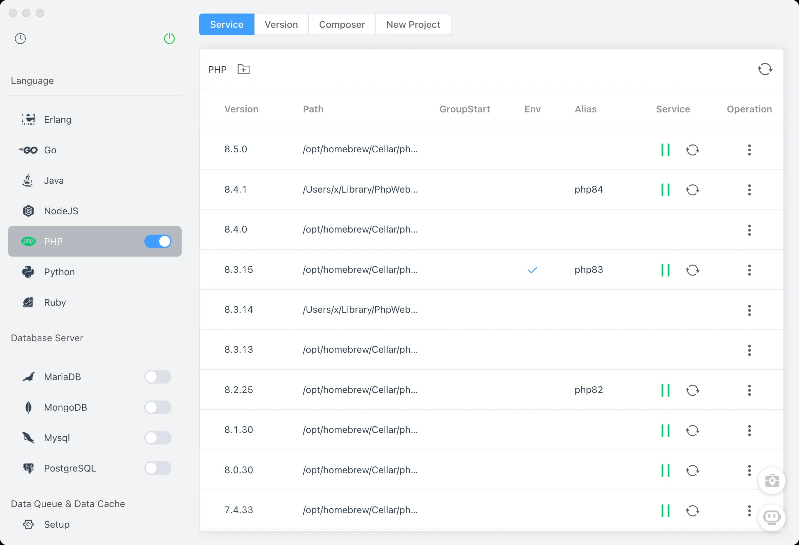
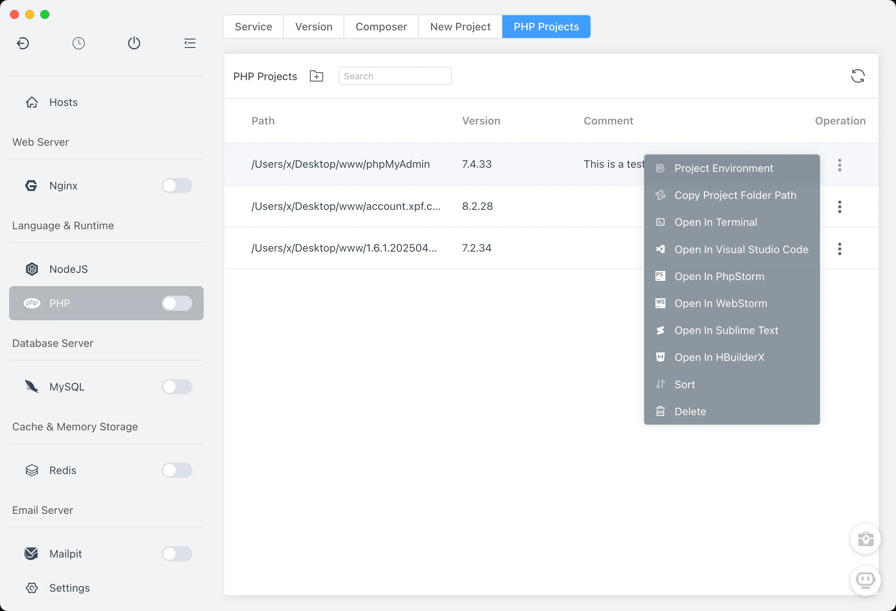
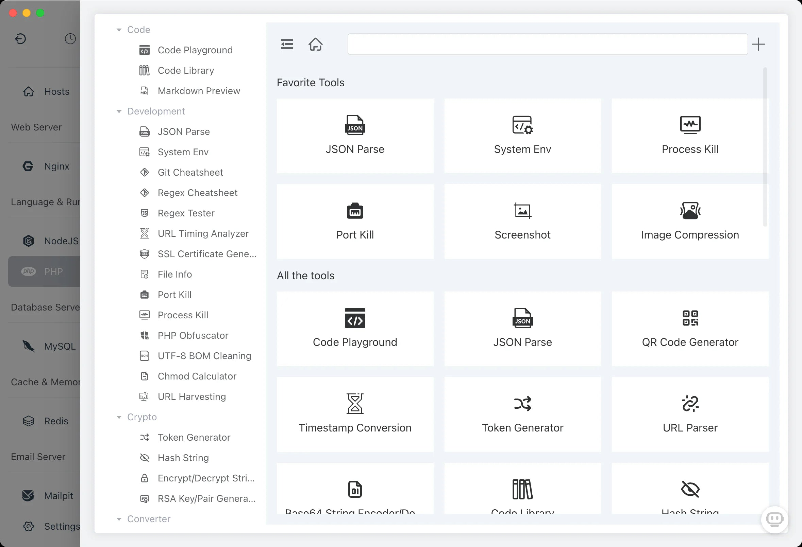

# FlyEnv

<div align="center">
  

  <h1>Develop Faster. Run Native. Forget Containers.</h1>

  <p>
    The lightweight, <strong>modular</strong> development environment for Windows, macOS, and Linux.<br>
    Switch versions instantly, manage databases, and deploy local SSL—<strong>zero Docker overhead</strong>.
  </p>

  <p>
    <a href="https://github.com/xpf0000/FlyEnv/releases"></a>
    <a href="https://github.com/xpf0000/FlyEnv/releases"></a>
    <a href="https://ko-fi.com/R5R2OJXTM"></a>
  </p>
</div>

---

## 🚀 Why FlyEnv?

Most dev tools are either too heavy (Docker Desktop) or too limited (NVM/Homebrew). FlyEnv hits the sweet spot:

| Feature | FlyEnv | Docker Desktop | XAMPP/MAMP |
| :--- | :--- | :--- | :--- |
| **Performance** | **🚀 Native (Binaries)** | 🐢 Slow (Virtualization) | 🚀 Native |
| **Resource Usage** | **🍃 Low RAM** | 🐘 Heavy (2GB+ Idle) | 🍃 Low |
| **Isolation** | **✅ Project-Based** | ✅ Container-Based | ❌ Global Only |
| **Setup Time** | **⚡️ < 1 Minute** | ⏳ Slow Builds | ⏳ Manual Config |

### Core Benefits
* **💎 Not Bloated:** FlyEnv is **modular**. It only installs the runtimes you explicitly need. Don't use Java? It won't touch your disk.
* **⚡ Native Speed:** Runs Nginx, PHP, and MySQL as static binaries. No containers means faster I/O and instant startup.
* **🛡️ Project Isolation:** Automatically switches Node/PHP versions when you `cd` into a project directory.
* **🔧 Full Stack Ready:** Need a Redis queue, MongoDB, or Minio? Enable them with one click.

---

## 🎯 Tailored for Your Workflow

<details open>
<summary><strong>🐘 For PHP & Laravel Developers</strong></summary>

> The best **Windows alternative to Laravel Herd**.
> * Switch between PHP 5.6, 7.4, 8.x instantly.
> * Run Nginx/Apache, MySQL, Redis, and Mailpit out of the box.
> * Native `composer` performance (no file-sharing lag).
> * **[Download for Windows](#Windows)**
</details>

<details>
<summary><strong>🟢 For Node.js & Frontend Developers</strong></summary>

> Stop fighting with NVM.
> * Define Node versions per project (automatically detects `package.json`).
> * Instant access to Elasticsearch, PostgreSQL, or RabbitMQ without `docker-compose`.
> * Supports Bun, Deno, and PM2 management.
</details>

<details>
<summary><strong>☕ For Java, Python & Go Developers</strong></summary>

> * Manage multiple JDKs (Maven/Gradle included) and Python environments effortlessly.
> * Keep your global system PATH clean and organized.
</details>

---

## 📦 Supported Modules (On-Demand)

FlyEnv allows you to install **only what you need** from a vast library of supported software:

* **AI Integration**: Ollama, DeepSeek, Chatbox.
* **Containers**: Podman.
* **Web Servers**: Apache, Nginx, Caddy, Tomcat, Consul.
* **Databases**: MySQL, MariaDB, PostgreSQL, MongoDB.
* **Email Server**: Mailpit.
* **Programming Languages**: PHP (Composer), Java (Maven), NodeJS, Python, Go, Erlang, Ruby, Rust (Rustup), Bun, Deno, Gradle.
* **Data Queue & Cache**: Redis, Memcached, RabbitMQ, etcd.
* **Search Engine**: Elasticsearch, Meilisearch, Typesense
* **Object Storage**: Minio.
* **Utilities**: DNS Server, FTP Server, Static HTTP Server.
* **Custom modules**: Users can add modules on their own, whether as services or commonly used commands. FlyEnv's custom module system ensures that user modules function just like system modules, delivering a seamless user experience.

> *All modules support multi-version co-existence.*

---

## 📥 Installation

### Windows (Recommended)
Finally, a fast, native environment for Windows developers.

* **Installer:** [FlyEnv-Setup-4.12.1.exe](https://github.com/xpf0000/FlyEnv/releases/download/v4.12.1/FlyEnv-Setup-4.12.1.exe)
* **Portable:** [FlyEnv-Portable-4.12.1.exe](https://github.com/xpf0000/FlyEnv/releases/download/v4.12.1/FlyEnv-Portable-4.12.1.exe)

### macOS
* **Homebrew:** `brew install flyenv`
* **DMG (Intel):** [FlyEnv-4.12.1.dmg](https://github.com/xpf0000/FlyEnv/releases/download/v4.12.1/FlyEnv-4.12.1.dmg)
* **DMG (Apple Silicon):** [FlyEnv-4.12.1-arm64.dmg](https://github.com/xpf0000/FlyEnv/releases/download/v4.12.1/FlyEnv-4.12.1-arm64.dmg)

### Linux
Supports Debian/Ubuntu (.deb) and RedHat/CentOS (.rpm).
#### Debian / Ubuntu
- **x86_64**: [FlyEnv-4.12.1-x64.deb](https://github.com/xpf0000/FlyEnv/releases/download/v4.12.1/FlyEnv-4.12.1-x64.deb)
- **ARM64**: [FlyEnv-4.12.1-arm64.deb](https://github.com/xpf0000/FlyEnv/releases/download/v4.12.1/FlyEnv-4.12.1-arm64.deb)

#### Red Hat / Fedora / SUSE / CentOS
- **x86_64**: [FlyEnv-4.12.1-x64.rpm](https://github.com/xpf0000/FlyEnv/releases/download/v4.12.1/FlyEnv-4.12.1-x64.rpm)
- **ARM64**: [FlyEnv-4.12.1-arm64.rpm](https://github.com/xpf0000/FlyEnv/releases/download/v4.12.1/FlyEnv-4.12.1-arm64.rpm)

---


## 📸 Interface Preview

|                     Service Management                      | Version Switching |
|:-----------------------------------------------------------:| :---: |
|  |  |
|          **Manage Nginx/MySQL/Redis in one place**          | **Switch PHP/Node versions per project** |

---

## 🛠 Developer-Friendly Tools

* **Local Domains & SSL:** Create local sites (`myapp.test`) with custom domains and **one-click HTTPS**.
* **Config & Logs:** Edit `php.ini` or `my.cnf` directly in FlyEnv. View real-time error logs with highlighting.
* **Port Management:** Visualize which apps are using which ports and kill processes instantly.


---

## Development & Contribution

We welcome contributions! FlyEnv is built with Node.js & web technologies (Electron/Vue).

```bash
git clone git@github.com:xpf0000/FlyEnv.git
cd FlyEnv
yarn install
yarn run dev
```

Check out our [Development Guide](./DEV.md) to get started.

## Community & Support

* **Technical Deep Dive:** [Architecture Analysis](https://deepwiki.com/xpf0000/FlyEnv)
* **Discord:** [Join Community](https://discord.gg/u5SuMGxjPE)
* **Discussions:** [GitHub Discussions](https://github.com/xpf0000/FlyEnv/discussions)
* **Website:** [flyenv.com](https://www.flyenv.com)

**License:** Open-source under the [BSD 3-Clause License](https://github.com/xpf0000/FlyEnv/blob/master/LICENSE).
