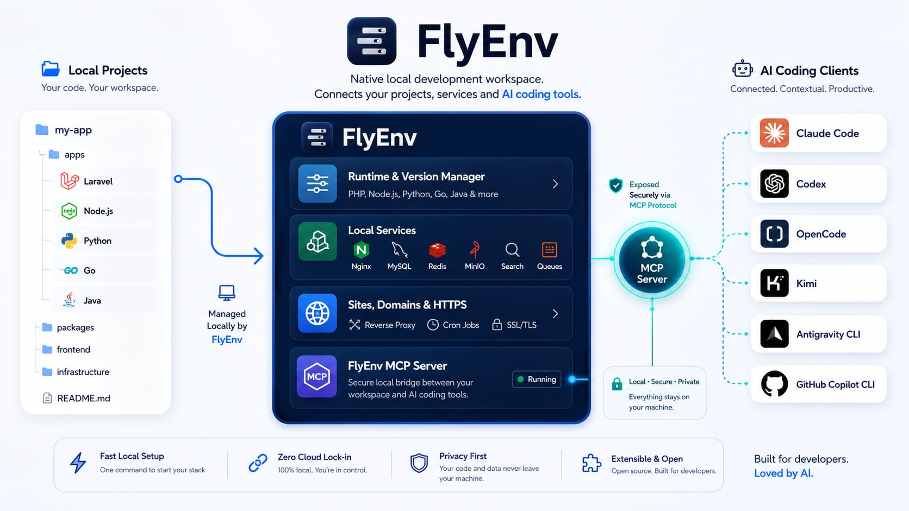
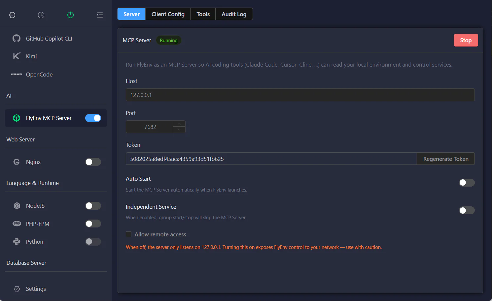

# FlyEnv

<div align="center">
  

  <h1>Manage Local Dev Stacks, AI Coding CLIs, and MCP Natively</h1>

  <p>
    <strong>FlyEnv is a desktop app for managing local development environments on Windows, macOS, and Linux.</strong><br>
    Install and run PHP, Node.js, Python, Java, .NET, Flutter, web servers, databases, queues, AI tools, AI coding CLIs, SSL, local domains, reverse proxies, and cron jobs from one UI.<br>
    Connect local services and project context to AI clients through the built-in FlyEnv MCP Server.<br>
    Use native binaries, switch versions per project, and keep your system PATH clean—<strong>no Docker required</strong>.
  </p>

*Best for web, backend, mobile, and full-stack developers who want local services without container overhead.*

  <p>
    <a href="https://github.com/xpf0000/FlyEnv/releases"></a>
    <a href="https://github.com/xpf0000/FlyEnv/releases"></a>
    <a href="https://ko-fi.com/R5R2OJXTM"></a>
  </p>
</div>

## What Can You Do With FlyEnv?

* **Install runtimes on demand:** PHP, Node.js, Python, Java, .NET, Flutter, Go, Rust, Ruby, Bun, Deno, and more.
* **Run local services:** Nginx, Apache, Caddy, MySQL, PostgreSQL, MongoDB, Redis, RabbitMQ, Elasticsearch, Minio/RustFS, and other common development dependencies.
* **Manage projects:** Switch runtime versions per project, define start/stop commands, expose projects through local domains, reverse proxies, HTTPS, and Cloudflare Tunnel.
* **Run AI coding workflows locally:** Install and manage Claude Code, Codex, OpenCode, Kimi, Antigravity CLI, and GitHub Copilot CLI from the same desktop workspace.
* **Expose your stack to AI agents:** Use the built-in FlyEnv MCP Server to let AI clients inspect services, sites, configs, logs, and selected lifecycle actions.
* **Handle daily dev tasks:** Edit configs and logs, inspect ports, schedule cron jobs, manage Git, generate certificates, compare diffs, test WebSocket/SSE, and work with JWTs.

Your environment adapts to your project, not the other way around—versions switch automatically as you move between projects:

```bash
cd ~/projects/legacy-wordpress
php -v   # PHP 7.4 (auto-loaded)
cd ~/projects/modern-laravel
php -v   # PHP 8.3 (auto-switched)
```

## Is FlyEnv For You?

| Choose FlyEnv if you... | It may not be the best fit if you... |
| :--- | :--- |
| Want XAMPP/MAMP/Herd-style convenience across many stacks | Need exact Docker Compose or Kubernetes parity with production |
| Work with multiple runtime versions across projects | Only use one runtime and are happy with your system package manager |
| Want databases, queues, search, storage, and AI tools without maintaining containers | Prefer to manage every service manually from the terminal |
| Build local web, backend, mobile, or full-stack projects on Windows, macOS, or Linux | Need a hosted platform or production deployment system |

---

## 🚀 How FlyEnv Fits

Most local dev tools are either too heavy for everyday work (Docker Desktop) or too low-level for full-stack projects (NVM/Homebrew/package managers). FlyEnv sits in the middle: a native desktop manager for the tools and services you actually run while building software.

What changed with FlyEnv 4.16 is that it no longer stops at the runtime and service layer. It now also manages AI coding CLIs and exposes your local environment through MCP, so your agent tools can work with the same projects, services, domains, and configs you already manage in FlyEnv.
That is the clearest difference versus traditional local-stack tools such as XAMPP, MAMP, or Herd: FlyEnv is not only a runtime manager, but also a local AI coding workspace.

| Capability | FlyEnv | Docker Desktop | XAMPP/MAMP |
| :--- | :--- | :--- | :--- |
| **How services run** | Native processes managed from a desktop UI | Containers managed through images and compose files | Native bundled web stack |
| **Scope** | Runtimes, databases, web servers, project services, and developer tools | Any containerized service or application | Primarily PHP/web-server/database stacks |
| **Project versions** | Built-in project runtime workflows | Defined in container configuration | Usually global or manual |
| **AI coding CLI workflow** | Built-in modules for local AI coding clients | Not built in | Not built in |
| **MCP access to local stack** | Built-in FlyEnv MCP Server | Manual setup | Not built in |
| **Best suited for** | Native local development across many stacks | Reproducible container-based environments | Traditional local PHP development |

### Core Benefits

* **On-Demand Modules:** Install only the runtimes and local services your projects need.
* **Native Processes:** Run installed services directly on your operating system rather than inside Docker containers.
* **Project Workflows:** Switch Node/PHP environments by project and define project service commands, ports, domains, and HTTPS.
* **Full-Stack Coverage:** Enable databases, queues, search engines, object storage, AI tools, and scheduled tasks from one app.
* **AI-Ready Local Workspace:** Manage AI coding CLIs and connect them to your local stack through the built-in FlyEnv MCP Server.
* **Multilingual UI:** Use FlyEnv in 30+ languages.

> **The real power is that everything works together.** A version switcher, a web server manager, a tunnel tool—you can find each of these elsewhere. What you can't find elsewhere is all of them in one window, sharing the same projects, sites, and workflow: `Install → Configure → Run → Reverse proxy → Tunnel → Debug → Ship`. The time you save isn't any one feature being fast. It's never having to leave.

---

## 🎯 Tailored for Your Workflow

<details open>
<summary><strong>🐘 For PHP & Laravel Developers</strong></summary>

> The best **Windows alternative to Laravel Herd**.

> * Switch between PHP 5.6, 7.4, 8.x instantly.
> * Run Nginx/Apache, MySQL, Redis, and Mailpit out of the box.
> * Native `composer` performance (no file-sharing lag).
> * **[Download for Windows](#windows-recommended)**

</details>

<details>
<summary><strong>🟢 For Node.js & Frontend Developers</strong></summary>

> Stop fighting with NVM.

> * Define Node versions per project (automatically detects `package.json`).
> * Instant access to Elasticsearch, PostgreSQL, or RabbitMQ without `docker-compose`.
> * Supports Bun, Deno, and PM2 management.

</details>

<details>
<summary><strong>☕ For Java, Python, .NET, Flutter & Go Developers</strong></summary>

> * Manage multiple JDKs (Maven/Gradle/SDKMAN), .NET SDKs, Flutter SDKs, and Python environments effortlessly.
> * Run Flutter diagnostics, Android device checks, and project build commands from one place.
> * Keep your global system PATH clean and organized.

</details>

<details>
<summary><strong>🤖 For AI Coding & Agent Workflows</strong></summary>

> * Install and manage Claude Code, Codex, OpenCode, Kimi, Antigravity CLI, and GitHub Copilot CLI from one app.
> * Register the built-in FlyEnv MCP Server into supported clients without hand-editing every config.
> * Let AI tools inspect local services, sites, versions, configs, and selected lifecycle actions against the same environment you use for development.

</details>

### AI Workflow at a Glance



The diagram above shows the workflow. The screenshot below shows the real FlyEnv MCP Server interface used to configure the bridge between your local stack and AI coding tools.



---

## 📦 Supported Modules (On-Demand)

FlyEnv allows you to install **only what you need** from a vast library of supported software:

* **AI Coding & MCP**: FlyEnv MCP Server, Claude Code, Codex, OpenCode, Kimi, Antigravity CLI, GitHub Copilot CLI.
* **AI Integration & Automation**: Hermes Agent, [OpenClaw], [n8n], [Ollama], CliProxyAPI.
* **Containers**: Podman.
* **Network Tunnel**: Cloudflared, Cloudflare Tunnel.
* **Web Servers**: FrankenPHP, [Apache], [Nginx], Caddy, Tomcat.
* **Databases**: [MySQL], [MariaDB], [PostgreSQL], [MongoDB], Qdrant.
* **Email Server**: [Mailpit].
* **Programming Languages & Runtime**: .NET, Flutter, PHP (Composer, [PHP-CLI], [PHP-FPM], [RoadRunner], [Swoole Cli]), Go, [Node.js], [Python], Java (Maven, Gradle, SDKMAN), Erlang, Ruby, Rust (Rustup), Bun, Deno, Zig.
* **Cache & Message Queue**: [Redis], Memcached, RabbitMQ.
* **Service Governance**: Consul, Etcd, R-Nacos
* **Search Engine**: Elasticsearch, Meilisearch, Typesense, ZincSearch
* **Object Storage**: RustFS, Minio.
* **Automation & Scheduling**: Cron Jobs.
* **Utilities**: Git, MkCert, DNS Server, FTP Server, Static HTTP Server.
* **Custom modules**: Users can add modules on their own, whether as services or commonly used commands. FlyEnv's custom module system ensures that user modules function just like system modules, delivering a seamless user experience.

> *All modules support multi-version co-existence.*

[OpenClaw]: https://youtu.be/j7_B-VzIyEU
[Ollama]: https://youtu.be/yPk9HQJRvb8
[n8n]: https://youtu.be/YnA1B3qmDJU
[Apache]: https://youtu.be/t7nKL45FdVk
[Nginx]: https://youtu.be/zfdNZFRt3k4
[MySQL]: https://youtu.be/uWWHAqxhVyk
[PHP-FPM]: https://youtu.be/OYP1IOoJOtI
[Python]: https://youtu.be/dhy0nJYsfQQ
[Redis]: https://youtu.be/u9xjPN-VWT4
[PHP-CLI]: https://youtu.be/5NqSag8c4YY
[RoadRunner]: https://youtu.be/5NqSag8c4YY
[Swoole CLI]: https://youtu.be/5NqSag8c4YY
[Node.js]: https://youtu.be/Pt_I3NDciZw
[MariaDB]: https://youtu.be/mvmbRi6KsgI
[PostgreSQL]: https://youtu.be/5gW3WHh8_Jw
[MongoDB]: https://youtu.be/wPjgwVeA6lw
[Mailpit]: https://youtu.be/D4MkA25Ofd0

---

## 🛠 Developer-Friendly Tools

* **Local Domains & SSL:** Create local sites (`myapp.test`) with custom domains and **one-click HTTPS** backed by MkCert/local certificates.
* **Project Services & Reverse Proxy:** Define custom start/stop commands, ports, reverse proxy rules, and HTTPS for projects in any language.
* **Cron Jobs:** Schedule global or site-scoped commands with native crontab and Windows Task Scheduler integration.
* **Config & Logs:** Edit `php.ini` or `my.cnf` directly in FlyEnv. View real-time error logs with highlighting.
* **Port Management:** Visualize which apps are using which ports and kill processes instantly.
* **Toolbox:** Compare text diffs, encode/decode JWTs, calculate cron schedules, and test WebSocket/SSE connections.

[Watch Video Demo](https://flyenv.com/#tools-modules)


---

## 📥 Installation

### Windows (Recommended)

Finally, a fast, native environment for Windows developers.

* **Installer:** [FlyEnv-Setup-4.17.0.exe](https://github.com/xpf0000/FlyEnv/releases/download/v4.17.0/FlyEnv-Setup-4.17.0.exe)
* **Portable:** [FlyEnv-Portable-4.17.0.exe](https://github.com/xpf0000/FlyEnv/releases/download/v4.17.0/FlyEnv-Portable-4.17.0.exe)

### macOS

* **Homebrew:** `brew install flyenv`
* **DMG (Intel):** [FlyEnv-4.17.0.dmg](https://github.com/xpf0000/FlyEnv/releases/download/v4.17.0/FlyEnv-4.17.0.dmg)
* **DMG (Apple Silicon):** [FlyEnv-4.17.0-arm64.dmg](https://github.com/xpf0000/FlyEnv/releases/download/v4.17.0/FlyEnv-4.17.0-arm64.dmg)

### Linux

Supports Debian/Ubuntu (.deb) and RedHat/CentOS (.rpm).

#### Debian / Ubuntu

- **x86_64**: [FlyEnv-4.17.0-x64.deb](https://github.com/xpf0000/FlyEnv/releases/download/v4.17.0/FlyEnv-4.17.0-x64.deb)
- **ARM64**: [FlyEnv-4.17.0-arm64.deb](https://github.com/xpf0000/FlyEnv/releases/download/v4.17.0/FlyEnv-4.17.0-arm64.deb)

#### Red Hat / Fedora / SUSE / CentOS

- **x86_64**: [FlyEnv-4.17.0-x64.rpm](https://github.com/xpf0000/FlyEnv/releases/download/v4.17.0/FlyEnv-4.17.0-x64.rpm)
- **ARM64**: [FlyEnv-4.17.0-arm64.rpm](https://github.com/xpf0000/FlyEnv/releases/download/v4.17.0/FlyEnv-4.17.0-arm64.rpm)

---

## Sponsors

<table>
  <tr>
    <td>
      <a href="https://signpath.io">
        
      </a>
    </td>
    <td>
      Free code signing on Windows provided by
      <a href="https://signpath.io">SignPath.io</a>, certificate by
      <a href="https://signpath.org">SignPath Foundation</a>.
    </td>
  </tr>
</table>

---

**📦 Build & Transparency**

All FlyEnv installation packages are now built using **[GitHub Actions](https://github.com/xpf0000/FlyEnv/actions)**. You can verify the build process and download the artifacts directly from the following links:

* **Global Build History:** [GitHub Actions](https://github.com/xpf0000/FlyEnv/actions)

---

## 📸 Interface Preview

<table>
<thead>
<tr>
<th width="50%" align="center">Service Management</th>
<th width="50%" align="center">Version Switching</th>
</tr>
</thead>
<tbody>
<tr>
<td align="center"><a target="_blank" rel="noopener noreferrer" href="./screen1.jpeg"></a></td>
<td align="center"><a target="_blank" rel="noopener noreferrer" href="./screen2.jpeg"></a></td>
</tr>
<tr>
<td align="center"><strong>Manage Nginx/MySQL/Redis in one place</strong></td>
<td align="center"><strong>Switch PHP/Node versions per project</strong></td>
</tr>
</tbody>
</table>

---

## Development & Contribution

We welcome contributions! FlyEnv is built with Node.js & web technologies (Electron/Vue).

```bash
git clone git@github.com:xpf0000/FlyEnv.git
cd FlyEnv
yarn install
yarn run dev
```

Check out our [Development Guide](./DEV.md) to get started.

## Community & Support

* **Technical Deep Dive:** [Architecture Analysis](https://deepwiki.com/xpf0000/FlyEnv)
* **Facebook Group:**[Facebook Group](https://www.facebook.com/groups/908637655411162)
* **Discord:** [Join Community](https://discord.gg/u5SuMGxjPE)
* **Discussions:** [GitHub Discussions](https://github.com/xpf0000/FlyEnv/discussions)
* **Website:** [flyenv.com](https://www.flyenv.com)

**License:** Open-source under the [BSD 3-Clause License](https://github.com/xpf0000/FlyEnv/blob/master/LICENSE).
