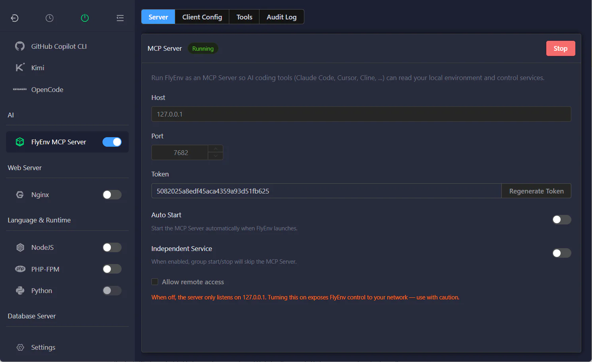
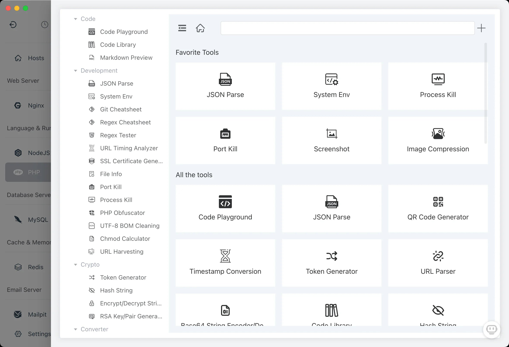

# FlyEnv

<div align="center">
  

  <h1>Native Local Development Environment for macOS, Windows & Linux</h1>

  <p>
    <strong>Manage runtimes, databases, web servers, local sites, HTTPS, developer tools, AI coding CLIs, and MCP from one desktop app.</strong>
  </p>

  <p>
    Run PHP, Node.js, Python, Java, Go, .NET, Flutter, MySQL, PostgreSQL, Redis, Nginx, Apache, Caddy, RabbitMQ, Elasticsearch, and more as native local services.<br>
    Switch versions per project, keep your system PATH clean, and connect your local development stack to AI coding tools through the built-in FlyEnv MCP Server.<br>
    <strong>No Docker required.</strong>
  </p>

  <p>
    <a href="https://github.com/xpf0000/FlyEnv/releases"></a>
    <a href="https://github.com/xpf0000/FlyEnv/releases"></a>
    <a href="https://github.com/xpf0000/FlyEnv/stargazers"></a>
    <a href="https://github.com/xpf0000/FlyEnv/blob/master/LICENSE"></a>
  </p>

  <p>
    <a href="https://www.flyenv.com/">Website</a> ·
    <a href="https://www.flyenv.com/download">Download</a> ·
    <a href="https://flyenv.com/guide/">Documentation</a> ·
    <a href="https://github.com/xpf0000/FlyEnv/discussions">Discussions</a> ·
    <a href="https://discord.gg/u5SuMGxjPE">Discord</a>
  </p>
</div>

---

## What is FlyEnv?

FlyEnv is a **native local development environment** for developers who want the convenience of tools such as XAMPP, MAMP, or Herd, but across a much broader development stack.

Instead of managing every runtime, database, web server, queue, local domain, certificate, and developer tool separately, FlyEnv brings them into one desktop workspace.

With FlyEnv you can:

- Install and manage multiple versions of programming languages and runtimes.
- Run databases, web servers, caches, queues, search engines, and object storage locally.
- Assign runtime versions to individual projects.
- Create local domains and HTTPS sites without configuring everything manually.
- Manage reverse proxies, project services, logs, ports, cron jobs, and tunnels.
- Install and manage AI coding CLIs from the same workspace.
- Connect supported AI clients to your local environment through the built-in **FlyEnv MCP Server**.

FlyEnv uses **native binaries and native processes**. It is not a Docker replacement and does not try to reproduce Docker Compose or Kubernetes environments. It is designed for fast, practical local development when you want your tools to run directly on Windows, macOS, or Linux.

---

## Why FlyEnv?

A typical local project may need much more than one language runtime:

```text
Application
├── PHP / Node.js / Python / Java / Go / .NET
├── Nginx / Apache / Caddy
├── MySQL / PostgreSQL / MongoDB
├── Redis / RabbitMQ
├── Elasticsearch / Meilisearch
├── Minio / RustFS
├── Mailpit
└── Local domain + HTTPS + reverse proxy
```

You can install and control these components from FlyEnv instead of maintaining a separate workflow for each one.

### Project-specific runtime versions

Your environment can follow the project you are working on:

```bash
cd ~/projects/legacy-wordpress
php -v   # PHP 7.4

cd ~/projects/modern-laravel
php -v   # PHP 8.3
```

This makes it easier to keep legacy and modern projects on the same machine without constantly rewriting global environment variables or system PATH entries.

### One workspace for the full local stack

FlyEnv combines functionality that is often spread across many separate tools:

`Install → Configure → Run → Local domain → HTTPS → Reverse proxy → Tunnel → Debug`

The value is not just that each individual feature exists. The important part is that they share the same projects, services, versions, sites, and local development workflow.

---

## Key Features

### Runtime & Version Management

Manage multiple versions of:

- PHP
- Node.js
- Python
- Java / JDK
- Go
- .NET
- Flutter
- Ruby
- Rust
- Bun
- Deno
- Erlang
- Zig

FlyEnv can keep different versions available side by side and use project-specific environments where supported.

### Local Services

Run common development dependencies directly on your operating system:

- Nginx, Apache, Caddy, FrankenPHP, Tomcat
- MySQL, MariaDB, PostgreSQL, MongoDB, ClickHouse, Qdrant, Neo4j
- Redis, Memcached, RabbitMQ
- Elasticsearch, Meilisearch, Typesense, ZincSearch
- Minio, RustFS
- Mailpit
- Consul, Etcd, R-Nacos, Temporal

### Local Sites, Domains & HTTPS

Create development sites such as:

```text
https://myapp.test
https://api.myapp.test
```

FlyEnv can manage local domains, certificates, HTTPS, ports, and reverse proxy rules without requiring you to maintain every configuration manually.

### Project Services

For applications that run their own development server, define:

- Start commands
- Stop commands
- Ports
- Runtime versions
- Reverse proxy rules
- HTTPS
- Local domains

This makes FlyEnv useful beyond traditional PHP-style web stacks.

### AI Coding CLIs & MCP

FlyEnv also acts as a local workspace for AI-assisted development.

You can manage AI coding tools such as:

- Claude Code
- Codex
- OpenCode
- Kimi
- Antigravity CLI
- GitHub Copilot CLI

The built-in **FlyEnv MCP Server** can expose selected local development context to supported AI clients, including services, sites, versions, configs, logs, and lifecycle actions.




### Developer Utilities

FlyEnv also includes tools for everyday local development tasks:

- Config file editing
- Real-time logs
- Port inspection and process termination
- Cron jobs / Windows Task Scheduler integration
- Git utilities
- Local certificates with MkCert
- DNS server
- FTP server
- Static HTTP server
- Text diff
- JWT encode/decode
- Cron expression tools
- WebSocket testing
- SSE testing
- Cloudflare Tunnel

---

## Who is FlyEnv for?

| FlyEnv is a good fit if you... | Another approach may be better if you... |
| :--- | :--- |
| Develop web, backend, mobile, or full-stack projects locally | Need exact production parity through Docker Compose or Kubernetes |
| Work with multiple runtime versions | Only use one runtime and prefer the system package manager |
| Need databases, queues, search, storage, or mail services during development | Prefer to configure and operate every local service manually |
| Want local domains, HTTPS, reverse proxies, and project services in one UI | Need a hosted deployment platform rather than a local development tool |
| Use Windows, macOS, or Linux | Require a container-first development workflow for every project |

### PHP & Laravel

FlyEnv can manage PHP versions, Composer, Nginx/Apache/Caddy, MySQL/MariaDB, PostgreSQL, Redis, Mailpit, local domains, and HTTPS in one place.

On Windows, this provides a native multi-stack workflow for developers looking beyond traditional XAMPP-style environments.

### Node.js & Frontend

Use project-specific Node.js versions and add PostgreSQL, Redis, Elasticsearch, RabbitMQ, or other services without creating a container stack for every local project.

FlyEnv also supports Bun, Deno, and PM2-related workflows.

### Java, Python, .NET, Flutter & Go

Manage JDKs, Maven, Gradle, SDKMAN, Python environments, .NET SDKs, Flutter SDKs, Go versions, and the local infrastructure those applications depend on.

### AI-assisted Development

Keep AI coding CLIs and your local development stack in the same workspace, then connect supported clients to FlyEnv through MCP instead of maintaining separate local-service context manually.

---

## Supported Modules

FlyEnv uses an on-demand module model: install the components you need and leave the rest out.

| Category | Modules |
| :--- | :--- |
| **AI Coding & MCP** | FlyEnv MCP Server, Claude Code, Codex, OpenCode, Kimi, Antigravity CLI, GitHub Copilot CLI |
| **AI & Automation** | Hermes Agent, [OpenClaw], [n8n], [Ollama], [CLIProxyAPI] |
| **Containers** | Podman |
| **Web Servers** | FrankenPHP, [Apache], [Nginx], [Caddy], Tomcat |
| **Databases** | [MySQL], [MariaDB], [PostgreSQL], [MongoDB], [Qdrant], [ClickHouse], Neo4j |
| **Languages & Runtimes** | .NET, Flutter, PHP, Go, [Node.js], [Python], Java, Erlang, Ruby, Rust, [Bun], Deno, Zig |
| **PHP Ecosystem** | Composer, [PHP-CLI], [PHP-FPM], [RoadRunner], [Swoole CLI] |
| **Cache & Queues** | [Redis], Memcached, [RabbitMQ] |
| **Search** | Elasticsearch, Meilisearch, Typesense, ZincSearch |
| **Object Storage** | RustFS, Minio |
| **Service Governance** | [Consul], [Etcd], [R-Nacos], [Temporal], [Temporal CLI] |
| **Email** | [Mailpit] |
| **Networking** | Cloudflared, Cloudflare Tunnel |
| **Automation** | Cron Jobs |
| **Utilities** | Git, MkCert, DNS Server, FTP Server, Static HTTP Server, [Numa] |

> FlyEnv supports multi-version coexistence for its modules where applicable.

### Custom Modules

FlyEnv also supports custom modules. You can add your own services or frequently used commands and integrate them into the same module workflow as built-in components.

---

## FlyEnv vs Docker Desktop vs XAMPP / MAMP

These tools solve different problems.

| Capability | FlyEnv | Docker Desktop | XAMPP / MAMP |
| :--- | :--- | :--- | :--- |
| Service model | Native local processes | Containers | Native bundled stack |
| Primary goal | General local development environment | Reproducible container environments | Traditional PHP/web stack |
| Multiple runtime families | Built in | Via images | Limited |
| Project-specific runtime workflows | Built in | Defined through container configuration | Usually limited/manual |
| Databases, queues, search, storage | Built-in modules | Via containers | Limited |
| Local domains & HTTPS | Built in | Requires project/container setup | Varies |
| AI coding CLI management | Built in | Not a core feature | Not built in |
| MCP access to local stack | Built-in FlyEnv MCP Server | Manual setup | Not built in |

**Use FlyEnv** when you want a broad local development stack running natively on your machine.

**Use Docker** when container isolation and reproducible production-like environments are more important to your workflow.

They can also coexist: FlyEnv does not require you to stop using containers for projects that benefit from them.

---

## Interface Preview

<table>
<thead>
<tr>
<th width="50%" align="center">Service Management</th>
<th width="50%" align="center">Version Switching</th>
</tr>
</thead>
<tbody>
<tr>
<td align="center"><a href="./screen1.jpeg"></a></td>
<td align="center"><a href="./screen2.jpeg"></a></td>
</tr>
<tr>
<td align="center"><strong>Manage local services in one place</strong></td>
<td align="center"><strong>Keep multiple runtime versions available</strong></td>
</tr>
</tbody>
</table>



---

## Installation

Download the latest release from:

**[GitHub Releases](https://github.com/xpf0000/FlyEnv/releases/latest)** · **[FlyEnv Download Page](https://www.flyenv.com/download)**

### Windows

FlyEnv provides installer and portable builds for Windows.

[Download FlyEnv for Windows](https://www.flyenv.com/download)

### macOS

Install with Homebrew:

```bash
brew install flyenv
```

Intel and Apple Silicon DMG packages are also available from the latest release.

[Download FlyEnv for macOS](https://www.flyenv.com/download)

### Linux

FlyEnv provides packages for common Linux distributions, including Debian/Ubuntu `.deb` packages and Red Hat/Fedora/SUSE/CentOS `.rpm` packages, with x86_64 and ARM64 builds where available.

[Download FlyEnv for Linux](https://www.flyenv.com/download)

---

## Video Demos

Many FlyEnv modules have short standalone demos:

- [Apache]
- [Nginx]
- [Caddy]
- [MySQL]
- [MariaDB]
- [PostgreSQL]
- [MongoDB]
- [Redis]
- [RabbitMQ]
- [ClickHouse]
- [Qdrant]
- [Mailpit]
- [PHP-CLI]
- [PHP-FPM]
- [RoadRunner]
- [Swoole CLI]
- [Node.js]
- [Python]
- [Bun]
- [Etcd]
- [Consul]
- [R-Nacos]
- [Temporal]
- [Temporal CLI]
- [OpenClaw]
- [Ollama]
- [n8n]
- [CLIProxyAPI]
- [Numa]

More demos are available on the FlyEnv website and project channels.

---

## Build Transparency

FlyEnv installation packages are built with **GitHub Actions**.

You can inspect the build history and workflow runs here:

**[GitHub Actions](https://github.com/xpf0000/FlyEnv/actions)**

---

## Development & Contribution

FlyEnv is built with Node.js and web technologies including Electron and Vue.

```bash
git clone git@github.com:xpf0000/FlyEnv.git
cd FlyEnv
yarn install
yarn run dev
```

See the **[Development Guide](./DEV.md)** for more information.

Contributions, bug reports, feature requests, and discussions are welcome.

---

## Community & Support

- **Website:** [flyenv.com](https://www.flyenv.com)
- **Documentation:** [flyenv.com/guide](https://flyenv.com/guide/)
- **GitHub Discussions:** [Join the discussion](https://github.com/xpf0000/FlyEnv/discussions)
- **Discord:** [Join the community](https://discord.gg/u5SuMGxjPE)
- **Facebook Group:** [FlyEnv Facebook Group](https://www.facebook.com/groups/908637655411162)
- **Architecture Analysis:** [DeepWiki](https://deepwiki.com/xpf0000/FlyEnv)

---

## Sponsor

<table>
<tr>
<td>
<a href="https://signpath.io">

</a>
</td>
<td>
Free Windows code signing is provided by <a href="https://signpath.io">SignPath.io</a>, with the certificate provided by the <a href="https://signpath.org">SignPath Foundation</a>.
</td>
</tr>
</table>

---

## License

FlyEnv is open-source under the **[BSD 3-Clause License](https://github.com/xpf0000/FlyEnv/blob/master/LICENSE)**.

---

[OpenClaw]: https://youtu.be/j7_B-VzIyEU
[Ollama]: https://youtu.be/yPk9HQJRvb8
[n8n]: https://youtu.be/YnA1B3qmDJU
[Apache]: https://youtu.be/t7nKL45FdVk
[Nginx]: https://youtu.be/zfdNZFRt3k4
[Caddy]: https://youtu.be/NuaYnRiD3AY
[MySQL]: https://youtu.be/uWWHAqxhVyk
[PHP-FPM]: https://youtu.be/OYP1IOoJOtI
[Python]: https://youtu.be/dhy0nJYsfQQ
[Redis]: https://youtu.be/u9xjPN-VWT4
[RabbitMQ]: https://youtu.be/ymbyrr5zGkI
[PHP-CLI]: https://youtu.be/5NqSag8c4YY
[RoadRunner]: https://youtu.be/5NqSag8c4YY
[Swoole CLI]: https://youtu.be/5NqSag8c4YY
[Node.js]: https://youtu.be/Pt_I3NDciZw
[MariaDB]: https://youtu.be/mvmbRi6KsgI
[PostgreSQL]: https://youtu.be/5gW3WHh8_Jw
[MongoDB]: https://youtu.be/wPjgwVeA6lw
[Mailpit]: https://youtu.be/D4MkA25Ofd0
[ClickHouse]: https://youtu.be/3ePJYddWYmQ
[Qdrant]: https://youtu.be/ahetMNLLS7s
[Etcd]: https://youtu.be/xsw8BQxii10
[Consul]: https://youtu.be/pa0QFgpu17w
[R-Nacos]: https://youtu.be/8ceC7QqY4UA
[CLIProxyAPI]: https://youtu.be/RmSl4jgmEyI
[Numa]: https://youtu.be/0qfnkr5V7eE
[Bun]: https://youtu.be/lu68kw8_3dY
[Temporal]: https://youtu.be/E_jetPnVxBo
[Temporal CLI]: https://youtu.be/80psOMuDK9I
[Elasticsearch]: https://youtu.be/B9Eo2Y-aXWQ
