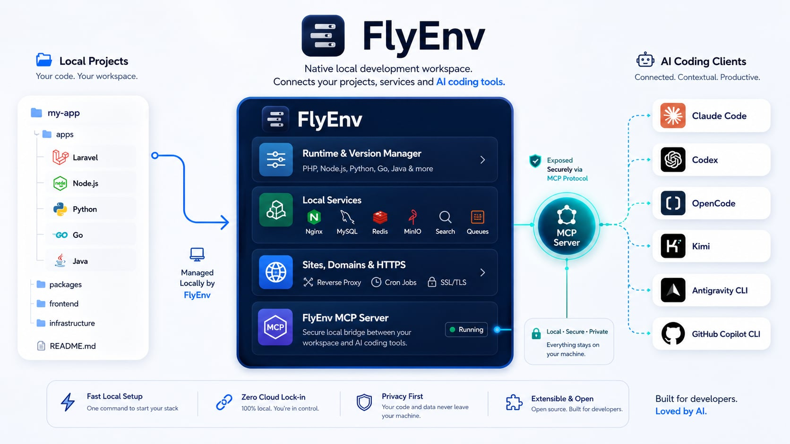
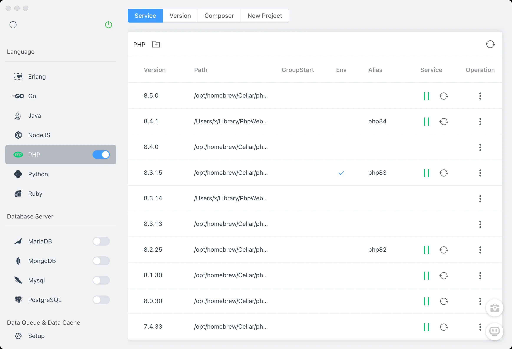
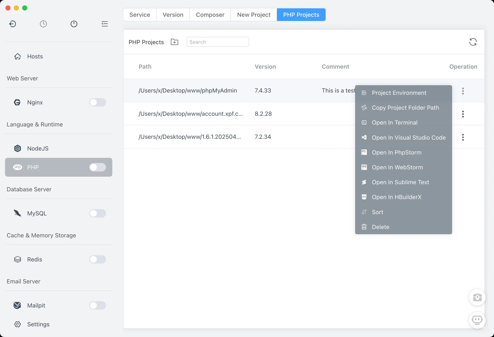

# FlyEnv

<div align="center">
  

  <h1>Run Your Complete Local Development Stack Natively</h1>

  <p><strong>FlyEnv is a native local development environment for Windows, macOS, and Linux.</strong><br>
  A modern alternative to XAMPP, MAMP, Laragon, and Laravel Herd — built for more than PHP.</p>

  <p>Manage PHP, Node.js, Python, Java, Go, databases, web servers, local sites, HTTPS, AI coding tools, and MCP from one desktop app.</p>

  <p>
    <a href="https://github.com/xpf0000/FlyEnv/releases"></a>
    <a href="https://github.com/xpf0000/FlyEnv/releases"></a>
  </p>

  <p>
    <a href="https://flyenv.com/download"><strong>Download</strong></a> ·
    <a href="https://flyenv.com/demos"><strong>Demos</strong></a> ·
    <a href="https://flyenv.com/guide/getting-started"><strong>Quick Start</strong></a> ·
    <a href="https://flyenv.com"><strong>Website</strong></a>
  </p>
</div>

---

## Why FlyEnv?

FlyEnv brings the local development tools you normally manage separately into one native desktop workspace.

- **No container setup required for everyday local development** — run installed services directly on your operating system.
- **One workspace for your stack** — runtimes, databases, web servers, queues, search, storage, local sites, and developer tools.
- **Per-project runtime versions** — switch PHP, Node.js, Python, and other environments by project.
- **Local domains and HTTPS** — create local sites such as `myapp.test` with certificates and reverse proxies.
- **AI-ready local development** — manage AI coding CLIs and expose selected local environment capabilities through the built-in FlyEnv MCP Server.
- **Cross-platform** — Windows, macOS, and Linux.

> If XAMPP, MAMP, Laragon, or Laravel Herd already make sense to you, FlyEnv solves a similar local-development problem — but across a broader stack.

---

## Coming from XAMPP, MAMP, Laragon, or Laravel Herd?

| If you are familiar with... | FlyEnv may fit when you need... |
| :--- | :--- |
| **XAMPP / MAMP** | More runtimes, databases, web servers, project-level versions, and local development services |
| **Laragon** | A cross-platform workflow across Windows, macOS, and Linux, plus broader runtime/service coverage and AI/MCP workflows |
| **Laravel Herd** | A broader environment beyond PHP/Laravel, including Node.js, Python, Java, Go, databases, infrastructure services, and AI/MCP |
| **Docker Desktop** | Native local services and a desktop workflow when you do not need container parity for the task |

Docker and FlyEnv solve overlapping but different problems. Use Docker when containerized reproducibility or production parity is the goal; use FlyEnv when you want a native local development workspace with less setup overhead.

---

## What Can You Run?

FlyEnv can manage complete local project stacks, not just one runtime.

- **Laravel** — PHP, MySQL/PostgreSQL, Redis, Node.js, Nginx, HTTPS
- **Django / Python web apps** — Python, PostgreSQL, Redis, Nginx, HTTPS
- **ERPNext** — Python, MariaDB, Redis, Nginx
- **Gitea** — Gitea, MySQL, Nginx, HTTPS
- **Local databases and services** — PostgreSQL, MongoDB, Redis, RabbitMQ, Elasticsearch, ClickHouse, Neo4j, Qdrant, MinIO/RustFS
- **AI coding workflows** — Claude Code, Codex, OpenCode, Kimi, GitHub Copilot CLI, and FlyEnv MCP Server

**[Browse FlyEnv demos →](https://flyenv.com/demos)**

---

## Core Capabilities

### Local stack management

- **Languages & runtimes:** PHP, Node.js, Python, Java, Go, .NET, Flutter, Ruby, Rust, Erlang, Bun, Deno, Zig
- **Databases:** MySQL, MariaDB, PostgreSQL, MongoDB, ClickHouse, Neo4j, Qdrant
- **Web & app servers:** Nginx, Apache, Caddy, FrankenPHP, Tomcat
- **Cache & messaging:** Redis, Memcached, RabbitMQ
- **Search & infrastructure:** Elasticsearch, Meilisearch, Typesense, ZincSearch, Consul, Etcd, R-Nacos, Temporal
- **Object storage:** MinIO, RustFS
- **AI & automation:** FlyEnv MCP Server, Claude Code, Codex, OpenCode, Kimi, GitHub Copilot CLI, Ollama, n8n, Hermes Agent, CLIProxyAPI
- **Other tools:** Cloudflare Tunnel, Mailpit, Cron Jobs, Git, MkCert, DNS Server, FTP Server, Static HTTP Server

### Project workflows

- Switch runtime versions per project
- Define project start/stop commands and ports
- Create local domains
- Enable HTTPS
- Configure reverse proxies
- Open configs and logs
- Group services and projects into reusable startup workflows

### AI coding & MCP

- Manage supported AI coding clients from FlyEnv
- Register the built-in FlyEnv MCP Server
- Let supported AI clients inspect selected services, sites, configs, logs, versions, and lifecycle actions
- Keep AI workflows and local project infrastructure in the same workspace



---

## Installation

### Windows

- **Installer:** [FlyEnv-Setup-4.18.2.exe](https://github.com/xpf0000/FlyEnv/releases/download/v4.18.2/FlyEnv-Setup-4.18.2.exe)
- **Portable:** [FlyEnv-Portable-4.18.2.exe](https://github.com/xpf0000/FlyEnv/releases/download/v4.18.2/FlyEnv-Portable-4.18.2.exe)

### macOS

```bash
brew install flyenv
```

- [FlyEnv-4.18.2.dmg (Intel)](https://github.com/xpf0000/FlyEnv/releases/download/v4.18.2/FlyEnv-4.18.2.dmg)
- [FlyEnv-4.18.2-arm64.dmg (Apple Silicon)](https://github.com/xpf0000/FlyEnv/releases/download/v4.18.2/FlyEnv-4.18.2-arm64.dmg)

### Linux

- [x86_64 `.deb`](https://github.com/xpf0000/FlyEnv/releases/download/v4.18.2/FlyEnv-4.18.2-x64.deb)
- [ARM64 `.deb`](https://github.com/xpf0000/FlyEnv/releases/download/v4.18.2/FlyEnv-4.18.2-arm64.deb)
- [x86_64 `.rpm`](https://github.com/xpf0000/FlyEnv/releases/download/v4.18.2/FlyEnv-4.18.2-x64.rpm)
- [ARM64 `.rpm`](https://github.com/xpf0000/FlyEnv/releases/download/v4.18.2/FlyEnv-4.18.2-arm64.rpm)

For the latest packages, see **[GitHub Releases](https://github.com/xpf0000/FlyEnv/releases)**.

---

## Interface Preview

<table>
<tr>
<th width="50%">Service Management</th>
<th width="50%">Version Switching</th>
</tr>
<tr>
<td></td>
<td></td>
</tr>
</table>

---

## Open Source & Build Transparency

FlyEnv is open source under the **BSD 3-Clause License**.

Installation packages are built through **[GitHub Actions](https://github.com/xpf0000/FlyEnv/actions)**.

Free Windows code signing is provided by [SignPath.io](https://signpath.io), with the certificate provided by the [SignPath Foundation](https://signpath.org).

---

## Development & Contribution

```bash
git clone git@github.com:xpf0000/FlyEnv.git
cd FlyEnv
yarn install
yarn run dev
```

See the [Development Guide](./DEV.md).

---

## Community & Support

- Website: https://flyenv.com
- Demos: https://flyenv.com/demos
- Guide: https://flyenv.com/guide/
- GitHub Discussions: https://github.com/xpf0000/FlyEnv/discussions
- Discord: https://discord.gg/u5SuMGxjPE
- Facebook Group: https://www.facebook.com/groups/908637655411162
- Architecture Analysis: https://deepwiki.com/xpf0000/FlyEnv

**License:** [BSD 3-Clause](https://github.com/xpf0000/FlyEnv/blob/master/LICENSE)
