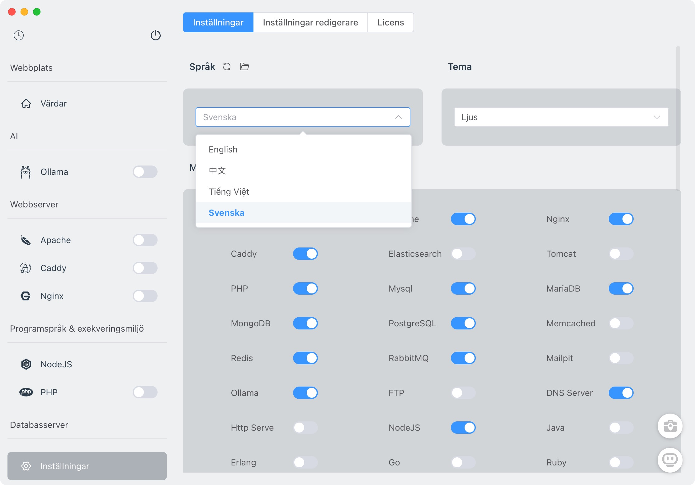

# FlyEnv


## All-In-One Full-Stack Environment Management Tool

FlyEnv is an all-in-one environment management tool designed for modern developers. It simplifies development by offering **swift multi-version switching**, **full-stack technology support**, and a **seamless cross-platform experience**. Whether you're working with PHP, NodeJS, Java, Go, or Python, FlyEnv integrates all necessary tools with a single command, eliminating configuration headaches and letting you focus on what truly matters—**creation, not debugging**.

**Detailed Project Analysis:** [https://deepwiki.com/xpf0000/FlyEnv](https://deepwiki.com/xpf0000/FlyEnv)

---

## Discussions

[What technical limitations does FlyEnv have compared to similar tools?](https://github.com/xpf0000/FlyEnv/discussions/262)

---

## Supported Platforms

FlyEnv supports **macOS**, **Windows**, and **Linux**.

[](https://github.com/xpf0000/FlyEnv/releases)
[](https://github.com/xpf0000/FlyEnv/releases)
[](https://ko-fi.com/R5R2OJXTM)

---

## Key Features

FlyEnv is packed with features to make your development workflow smoother and more efficient:

### Core Modules
- **AI Integration**: Ollama, DeepSeek, Chatbox.
- **Web Servers**: Apache, Nginx, Caddy, Tomcat.
- **Databases**: MySQL, MariaDB, PostgreSQL, MongoDB.
- **Email Server**: Mailpit.
- **Programming Languages**: PHP (Composer), Java (Maven), NodeJS, Python, Go, Erlang, Ruby.
- **Data Queue & Cache**: Redis, Memcached, RabbitMQ.
- **Search Engine**: Elasticsearch.
- **Object Storage**: Minio.
- **Utilities**: DNS Server, FTP Server, Static HTTP Server.

### Highlights
- **Swift Multi-Version Switching**:
  Seamlessly switch between multiple versions of PHP, NodeJS, Java, and more. For example, run PHP 5.6 and PHP 8.3 side by side, or switch between JDK 8 and JDK 20 in seconds.

- **Full-Stack Environment Integration**:
  From web servers (Nginx/Apache) to databases (MySQL/Redis) and message queues, FlyEnv provides a one-command setup for your entire tech stack.

- **Project-Level Environment Isolation**:
  FlyEnv enables per-project runtime version management for NodeJS/PHP/Python and more. The environment automatically switches when entering the project directory via Terminal or PowerShell — **no manual setup required**.

- **Native Performance**:
  FlyEnv runs as native static binaries, eliminating the overhead of virtual containers. This means faster startup times, lower memory usage, and a smoother development experience.

- **Cross-Platform Consistency**:
  Whether you're on macOS, Windows, or Linux, FlyEnv ensures a consistent development environment across all platforms. Say goodbye to "it works on my machine" issues.

- **Resource Efficiency**:
  FlyEnv is lightweight and optimized for performance. Running Nginx, PHP, MySQL, and Redis together consumes less than one-third of the resources compared to traditional Docker setups.

- **Developer-Friendly Tools**:
  - **Config & Log Management**: Aggregate all configuration files with a single command and access them directly in VSCode or Vim. Real-time log streaming with error highlighting makes debugging a breeze.
  - **Local Web Hosting**: Create local sites with custom domain names and HTTPS support.
  - **One-Click SSL Certificates**: Generate self-signed SSL certificates with a single click.

- **Production-Ready Environments**:
  FlyEnv's configurations are designed to mirror real-world production environments, making it easy to transition from development to deployment.

---

## Installation

### macOS
#### Homebrew
```bash
brew install flyenv
```

#### Intel (x86)
- [FlyEnv-4.9.9.dmg](https://github.com/xpf0000/FlyEnv/releases/download/v4.9.9/FlyEnv-4.9.9.dmg)
- [FlyEnv-4.9.9-mac.zip](https://github.com/xpf0000/FlyEnv/releases/download/v4.9.9/FlyEnv-4.9.9-mac.zip)

#### Apple Silicon (ARM64)
- [FlyEnv-4.9.9-arm64.dmg](https://github.com/xpf0000/FlyEnv/releases/download/v4.9.9/FlyEnv-4.9.9-arm64.dmg)
- [FlyEnv-4.9.9-arm64-mac.zip](https://github.com/xpf0000/FlyEnv/releases/download/v4.9.9/FlyEnv-4.9.9-arm64-mac.zip)

> **Tip**: For a lightweight PHP and web server solution, check out [FlyPHPServer](https://flyenv.com/flyphpserver.html), available on the [Mac App Store](https://apps.apple.com/us/app/flyphpserver/id1506384441).

---

### Windows

#### Installer version

- [FlyEnv.Setup.4.9.8.exe](https://github.com/xpf0000/FlyEnv/releases/download/v4.9.8/FlyEnv.Setup.4.9.8.exe)

#### Portable version

- [FlyEnv.Portable.4.9.8.exe](https://github.com/xpf0000/FlyEnv/releases/download/v4.9.8/FlyEnv.Portable.4.9.8.exe)

---

### Linux
#### Debian / Ubuntu
- **x86_64**: [PhpWebStudy_4.0.0_amd64.deb](https://github.com/xpf0000/FlyEnv/releases/download/v4.0.0/PhpWebStudy_4.0.0_amd64.deb)
- **ARM64**: [PhpWebStudy_4.0.0_arm64.deb](https://github.com/xpf0000/FlyEnv/releases/download/v4.0.0/PhpWebStudy_4.0.0_arm64.deb)

#### Red Hat / Fedora / SUSE / CentOS
- **x86_64**: [PhpWebStudy-4.0.0.x86_64.rpm](https://github.com/xpf0000/FlyEnv/releases/download/v4.0.0/PhpWebStudy-4.0.0.x86_64.rpm)
- **ARM64**: [PhpWebStudy-4.0.0.aarch64.rpm](https://github.com/xpf0000/FlyEnv/releases/download/v4.0.0/PhpWebStudy-4.0.0.aarch64.rpm)

---

## Application Interface



---

## Development

### Clone the Repository
```bash
git clone git@github.com:xpf0000/FlyEnv.git
```

### Install Dependencies
```bash
cd FlyEnv
yarn install
```

### Run in Development Mode
```bash
yarn run dev
```

### Build the Project
```bash
yarn run build
```

---

## Contributing

We welcome contributions! Whether you're testing, translating, designing, or coding, your help makes FlyEnv better. Check out our [Development Guide](./DEV.md) to get started.

---

## Feedback & Support

- **Discord Community**: [Join Here](https://discord.gg/u5SuMGxjPE)
- **GitHub Issues**: [Feedback](https://github.com/xpf0000/FlyEnv/issues)
- **GitHub Discussions**: [Discussions](https://github.com/xpf0000/FlyEnv/discussions)

---

## License

FlyEnv is open-source under the [BSD 3-Clause License](https://github.com/xpf0000/FlyEnv/blob/master/LICENSE).

---

## Visit Our Website

For detailed tutorials and documentation, visit [https://www.flyenv.com](https://www.flyenv.com).
