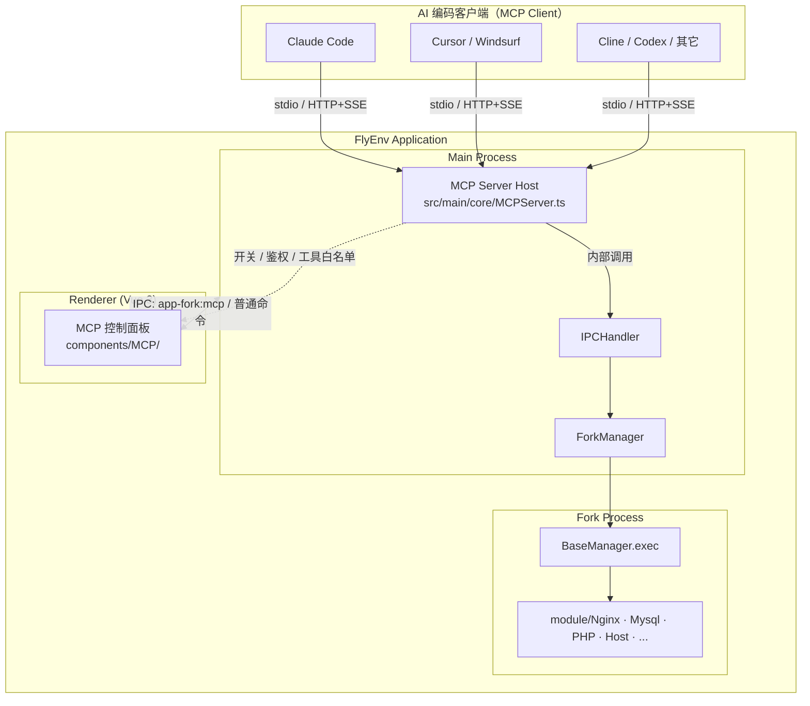
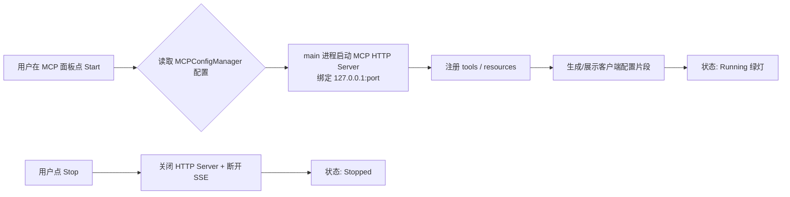
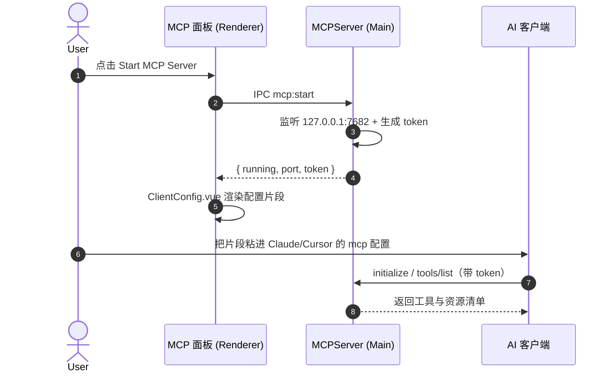
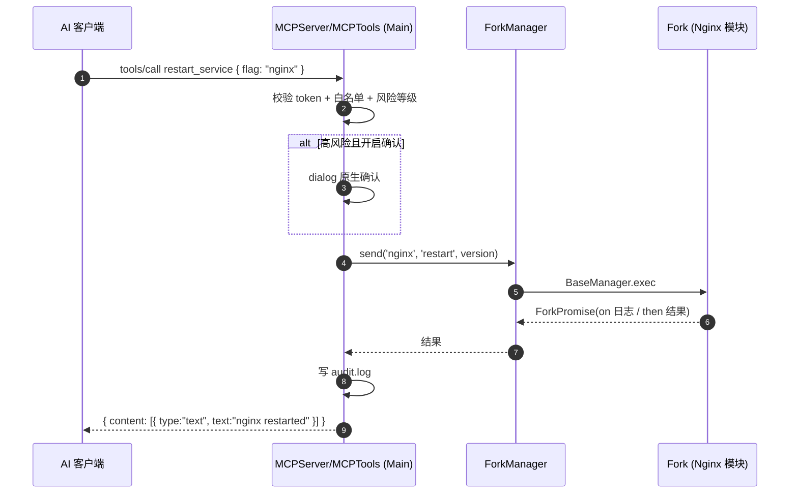

# FlyEnv MCP Server 集成方案

> **文档版本**: v1.0
> **编制日期**: 2026-06-25
> **目标 FlyEnv 版本**: 4.16.x+
> **灵感来源**: Laravel Herd「Boost / MCP」特性（见 `docs/img.png` 对应掘金文章）—— Herd 内置一个 MCP Server，让 Claude / Cursor / Codex 等 AI 编码助手能够直接读取并操控本地开发环境（站点、PHP 版本、日志、数据库等）。
> **现状（已核对源码）**: FlyEnv 已落地 AI CLI 模块 `ClaudeCode` / `Codex` / `Kimi` / `OpenCode`（`src/render/components/*` + `src/fork/module/*`）。其中 ClaudeCode/Codex/OpenCode 已有 `MCP.vue`，但那是 **MCP Client 管理**（FlyEnv 帮你编辑这些 CLI 要连哪些 MCP Server，底层跑 `claude mcp add/remove/list`）。**本方案方向相反：让 FlyEnv 自己成为一个 MCP Server。**
> **相关说明**: `docs/design/712-ai-coding-cli-integration.md` 为**废弃方案**，实际实现以上述 4 个模块为准，本文件引用一律指向真实模块。

---

## 1. 模块定位（Module Positioning）

**一句话定义**: MCP Server 模块让 FlyEnv 从「被人操作的 GUI」升级为「可被 AI 助手编程驱动的本地环境控制面」—— 它把 FlyEnv 已有的服务/站点/版本/日志能力，通过 [Model Context Protocol](https://modelcontextprotocol.io) 标准协议暴露为一组 **tools / resources**，使外部 AI 编码工具（Claude Code、Cursor、Windsurf、Cline、Codex 等任意 MCP Client）能够查询状态、启停服务、切换版本、读取日志、管理本地站点。

### 1.1 关键区分：与现有 AI 方案的方向相反

这是本方案最重要的认知，必须先讲清楚，避免和已落地的模块混淆：

| 方案 | 控制方向 | 角色 | 现状 |
|------|---------|------|------|
| ClaudeCode/Codex/Kimi/OpenCode 模块 | FlyEnv **运行** AI CLI | FlyEnv 是宿主，AI CLI 是被管理子进程 | 已实现 |
| 上述模块的 `MCP.vue` | FlyEnv 帮 AI CLI **配置** 它要连的 MCP Server | FlyEnv 是 MCP **Client 配置器**（跑 `claude mcp add/remove/list`） | 已实现 |
| Hermes-Agent | FlyEnv **运行** Agent 运行时 | FlyEnv 是宿主 | 方案阶段 |
| **MCP Server（本方案）** | AI 工具 **驱动** FlyEnv | **FlyEnv 是 MCP Server 被调用方** | 本方案 |

> 关键互补关系：现有 `MCP.vue` 已经能往 Claude Code 里**添加任意 MCP Server**。本方案让 FlyEnv 自身成为一个 MCP Server 后，`MCP.vue` 就能**一键把「FlyEnv」加进 ClaudeCode/Codex/OpenCode 的 MCP 列表**——即 `addMcp('flyenv', 'http', 'http://127.0.0.1:7682')`。两者天然咬合，落地后形成闭环：FlyEnv 既帮你接外部 MCP，也把自己作为 MCP 提供出去。

### 1.2 架构层级



*代码锚点（已核对）：IPC 路由 `src/main/core/IPCHandler.ts:51` `ipcMain.on('command', ...)`；Fork 派发 `src/fork/BaseManager.ts` 的 `exec` if-else 链；模块基类 `src/fork/module/Base/index.ts`。*

---

## 2. 核心价值（User Value）

| 场景 | 解决的痛点 | 关键能力 |
|------|-----------|---------|
| **S1: AI 感知本地环境** | AI 助手不知道你本地跑着什么、版本是多少，只能瞎猜或反复让你贴信息。 | `list_services` / `service_status` / `list_sites` 等 resource，让 AI 一次拿到全量上下文。 |
| **S2: AI 自助排障** | 「我的站点 500 了」——AI 看不到 Nginx/PHP-FPM 日志，无法定位。 | `read_log(service)` tool 直接把错误日志喂给 AI，由它读栈、给修复建议。 |
| **S3: 自然语言操控环境** | 「把 demo.test 切到 PHP 8.3 并重启 Nginx」需要点一堆 UI。 | `set_site_php_version` + `restart_service` + `update_site` tools，一句话完成（注意 PHP 切版本是按站点的，见 §3.2.1）。 |
| **S4: 项目脚手架自动化** | 新建本地站点（域名 + 反代 + HTTPS）步骤繁琐。 | `create_site` tool 复用 `Host` 模块一键建站，AI 在初始化项目时自动调用。 |
| **S5: 跨工具统一** | 团队成员用 Claude Code，也有人用 Cursor，重复配置环境上下文。 | MCP 是标准协议，**一次实现，所有 MCP Client 通吃**。 |

---

## 3. 现有架构关键事实（集成依据）

> 与 #712 共用同一套基础设施，以下均已在本仓库核对。

### 3.1 IPC ↔ Fork 链路（MCP Server 内部如何调用 FlyEnv 能力）

```
MCP tool handler（main 进程内）
  → 复用 IPCHandler 的 fork 转发能力（ForkManager.send(module, ...args)）
  → fork/index.ts → BaseManager.exec([key, module, fn, ...args])
  → module.fn() 返回 ForkPromise → 成功 / 日志(on) / 错误 回传
```

关键点：MCP Server 跑在 **main 进程**，它需要的不是 IPC（那是给 renderer 的），而是**直接拿到 `ForkManager` 句柄**去调 fork。`ForkManager.send(module, ...args).on(...).then(...)` 已是现成入口（`IPCHandler.ts:117-120` 即此用法）。因此 MCP tool 的实现本质是：把 MCP 协议的 `tools/call` 参数翻译成 `(module, fn, ...args)`，await fork 结果，再翻译回 MCP 响应。

### 3.2 服务控制面（fork 模块可调用的操作）

`Base` 基类（`src/fork/module/Base/index.ts`）与各服务模块（Nginx/Mysql/PHP/Redis…）提供的稳定操作：

| 操作 | 方法 | MCP 暴露为 |
|------|------|-----------|
| 启动 | `_startServer(version)` / `startService` | tool `start_service` |
| 停止 | `_stopService()` | tool `stop_service` |
| 重启 | `restart` | tool `restart_service` |
| 切「当前版本」 | **非单一 fork 方法**，见 §3.2.1 | tool `set_current_version`（**需在 main 层编排**） |
| 在线版本 | `fetchAllOnlineVersion` | resource `available_versions` |
| 安装 | `installSoft` | tool `install_service`（**高风险，默认需确认**） |
| 配置读写 | `getConfig` / `editConfig` | tool `read_config` / `write_config`（写默认需确认） |
| 日志 | 日志文件 `tail` | tool `read_log` |

模块清单：`src/render/core/type.ts` 的 `AppModuleEnum`（101 个 `typeFlag`，即 `AllAppModule`）是工具枚举参数的权威来源。

#### 3.2.1 「切版本」到底是什么操作（已核对源码，勿想当然）

源码核对结论，避免误设计：

- **不存在 `versionSwitch` 这类 fork 方法**；`Base._linkVersion`（`src/fork/module/Base/index.ts:55`）只是 `startService` 内部在 macOS/Linux 跑 `brew unlink && brew link` 的副作用，**Windows 上直接 `resolve(true)` 是空操作**，不是用户可调用的「切版本」。
- **「当前/活动版本」是渲染层 + 配置态概念**，持久化在 `ConfigManager` 的 `server[flag].current`（`src/render/store/app.ts` + `src/render/core/Module/Module.ts`）。
- **用户实际怎么切**：
  - **单实例服务**（`isOnlyRunOne`，如多数后台服务）：用户「启动某个已安装版本」即完成切换 —— `onItemStart`（`Module.ts:43`）会停掉其它版本、把所选版本写入 `server[flag].current` 并 `saveConfig`。所以「切版本」= 选定版本后启动它 + 落 `current`。
  - **PHP 特殊**：`resetCurrentVersion`（`Module.ts:75`）显式 `typeFlag !== 'php'` —— PHP 的版本是**按站点**（`AppHost.phpVersion`）或 CLI 默认版本管理的，不是全局单一 current。
- **对 MCP 的设计含义**：`set_current_version` tool **不能简单转发给某个 fork 方法**，必须在 main 层编排：①更新 `server[flag].current` 配置 → ②（单实例服务）停其它版本 + 启所选版本。PHP 需单独的 `set_site_php_version`（走 `Host` 模块）。一期可先不做切版本，避免踩这块状态逻辑（见 §9）。

### 3.3 站点 / 项目控制面

`AppHost`（`src/shared/app.d.ts`）+ `Host` 模块（`src/fork/module/Host/index.ts`）：
- `hostList()` → resource `list_sites`
- `handleHost(host, flag, old, park)` → tools `create_site` / `update_site` / `delete_site`（自动处理 hosts 文件、Nginx/Apache/Caddy 配置、SSL）

### 3.4 配置持久化（独立存储，不挤进现有 user.json）

现有 `src/main/core/ConfigManager.ts` 是单个 electron-store（`name: 'user'` → `user.json`），其 `ConfigOptions` 已相当臃肿。**MCP 配置不并入该文件，单独拆为一个独立 store**：

- 新增 `src/main/core/MCPConfigManager.ts`，内部 `new Store({ name: 'mcp' })` → 落盘为与 `user.json` 同目录的 **独立 `mcp.json`**，互不影响、可独立重置。
- 结构（自带类型，不污染 `ConfigOptions`）：

```ts
// src/main/core/MCPConfigManager.ts
interface MCPConfigOptions {
  enabled: boolean
  transport: { http: boolean; stdio: boolean }
  host: string          // 默认 '127.0.0.1'
  port: number          // 默认 7682
  token: string         // 启动时若空则生成
  enabledTools: string[]        // 工具白名单
  approval: Record<string, 'auto' | 'confirm'>  // 各 tool 审批策略
  allowRemote: boolean  // 默认 false（仅回环）
}
```

- 对外接口与 `ConfigManager` 同构（`getConfig` / `setConfig` / `reset`），由 `Application` 在启动时实例化，注入给 `MCPServer` 与 `IPCHandler`。
- 渲染层照常用 IPC 读写（`mcp:getConfig` / `mcp:setConfig`），**Pinia `app.ts` 也无需新增字段** —— MCP 面板维护自己的局部状态。
- token 仍经 main 进程管理；如需更强保护可叠加 Electron `safeStorage`（与 #11 ClaudeCode apiKey 加密同款，见现有 `IPCHandler` 的 safeStorage 用法）。

### 3.5 模块注册三件套（照抄 ClaudeCode 模块即可）

1. 渲染端 `src/render/components/MCP/Module.ts`（`AppModuleItem`；参考 `ClaudeCode/Module.ts`，`moduleType` 可归 `ai` 或 `other`，`isService: true` —— MCP Server 本身是个可启停的本地服务）。
2. 类型登记 `src/render/core/type.ts`：`AppModuleEnum.mcp`（命名注意与现有 `claudeCode` 等驼峰风格一致）。
3. Fork 后端 `src/fork/BaseManager.ts`：`exec` 链新增 `else if (module === 'mcp') { import('./module/MCP'); doRun(...) }`。

---

## 4. 协议与运行形态设计

### 4.1 MCP SDK 选型

采用官方 TypeScript SDK **`@modelcontextprotocol/sdk`**（Node 原生、与 Electron main 进程同构，无需 Python 依赖，契合 FlyEnv「原生优先」理念）。新增依赖：

```jsonc
// package.json dependencies
"@modelcontextprotocol/sdk": "^1.x"
```

### 4.2 两种 Transport（同时支持，覆盖所有客户端）

| Transport | 适用客户端 | FlyEnv 形态 | 取舍 |
|-----------|-----------|------------|------|
| **stdio** | Claude Desktop、Cursor、Cline 等本地工具 | 用户在客户端配置里指向一个 FlyEnv 提供的 **stdio 启动器**（轻量 Node 脚本，转发到运行中的 FlyEnv）| 客户端生态默认，必须支持 |
| **Streamable HTTP + SSE** | 远程 / 容器内客户端、WSL、浏览器型工具 | FlyEnv main 进程内监听 `127.0.0.1:<port>`（默认 7682，可改）| 长连接、可多客户端，默认仅绑回环地址 |

> stdio 的落地难点：MCP stdio Server 通常是「客户端 fork 一个进程」。但 FlyEnv 的能力在 **已运行的 Electron 主进程** 里。方案：提供一个极薄的 stdio bridge 脚本（随 FlyEnv 安装，路径写入客户端配置），它通过本地 socket / HTTP 把请求转发给运行中的 FlyEnv MCP HTTP endpoint。若 FlyEnv 未启动则提示用户先启动。这样两种 transport 复用同一套 tool 实现。

### 4.3 生命周期：MCP Server 作为可启停服务



MCP Server 跑在 main 进程（非 fork），因为它要长期持有 `ForkManager` 句柄并维护与客户端的长连接。UI 通过普通 IPC 命令（如 `mcp:start` / `mcp:stop` / `mcp:status`）控制，参照 `IPCHandler` 的 `handleRegularCommand` 分支。

---

## 5. 工具与资源清单（首期）

### 5.1 Resources（只读上下文，AI 主动拉取）

| Resource URI | 内容 | 底层 |
|--------------|------|------|
| `flyenv://services` | 所有模块及安装/运行状态 | `AppModuleEnum` + 各模块 status |
| `flyenv://services/{flag}/versions` | 某服务的已装/在线版本 | `fetchAllOnlineVersion` / 本地扫描 |
| `flyenv://sites` | 本地站点列表（域名/根目录/PHP 版本/SSL） | `Host.hostList()` |
| `flyenv://env` | 平台、BaseDir、代理等环境摘要 | `global.Server` |

### 5.2 Tools（带副作用，按风险分级）

| Tool | 参数 | 风险 | 审批 |
|------|------|------|------|
| `service_status` | `flag` | 只读 | 否 |
| `read_log` | `flag`, `lines?` | 只读 | 否 |
| `read_config` | `flag` | 只读 | 否 |
| `start_service` | `flag`, `version?` | 中 | 可配置 |
| `stop_service` | `flag` | 中 | 可配置 |
| `restart_service` | `flag` | 中 | 可配置 |
| `set_current_version` | `flag`, `version` | 中 | 可配置；**main 层编排，非单一 fork 调用**，见 §3.2.1 |
| `set_site_php_version` | `siteName`, `phpVersion` | 中 | PHP 按站点切版本，走 `Host` 模块 |
| `list_sites` / `create_site` / `update_site` | `AppHost` 字段 | 中-高 | `create/update` 默认需确认 |
| `write_config` | `flag`, `content` | 高 | **默认强制确认** |
| `install_service` / `delete_site` | … | 高 | **默认强制确认** |

### 5.3 安全模型（默认安全，对齐项目既有规范）

1. **仅绑回环**：HTTP transport 默认 `127.0.0.1`，不监听 `0.0.0.0`；UI 若允许远程访问需显式开启并强提示。
2. **Bearer Token 鉴权**：启动时生成随机 token，客户端配置片段内置；HTTP transport 校验 `Authorization`。
3. **工具白名单**：`MCPConfigManager` 的 `enabledTools`，用户可关闭任意高风险 tool；默认只读 + 启停开，**写配置/安装/删除默认关闭**。
4. **写操作确认**：高风险 tool 触发时，可选「弹 FlyEnv 原生确认框」模式（main 进程 `dialog`），AI 无法静默执行破坏性操作。
5. **bin / path / 凭据：默认返回，不屏蔽（已修正设计）**：FlyEnv 是本地开发工具，`bin`/`path`/`version` 是 AI 代理执行任务的**必需材料**（如「用 PHP 7.3 跑某文件」需要该版本 bin 绝对路径、「用 mysql.exe 连本地库」需要 bin + root 密码）。这些命令只能由代理在自己的 shell 里执行，FlyEnv 不可能内建万能 exec，因此必须把执行材料交给代理。
   - 威胁模型澄清：本 server 是 loopback + token，连入的代理跑在用户本机、通常已有用户权限（能直接读磁盘/进程）。**凡 MCP 能返回的，代理本就能拿到**，屏蔽只是 security theater，代价却是废掉核心场景。
   - 故 `serializeVersion` 默认返回 `bin`/`path`/`phpBin`/`rootPassword` 等；`serializeSite` 默认返回 `root`/`port`/`ssl`/`envFile` 等。
   - **可选 `maskSecrets` 开关（默认 false）**：仅给「会共享屏幕 / 担心云端日志」的谨慎用户保留——开启后剔除 `rootPassword`、SSL 私钥，并对 `read_log`/`read_config` 的疑似密钥行掩码。不删能力，只改默认。
6. **审计日志**：所有 tool 调用记入 `BaseDir/mcp/audit.log`，UI 可查。

---

## 6. 文件结构（新增 / 改动）

```
src/main/core/
  MCPServer.ts                 # 新增：MCP Server 宿主（HTTP+SSE transport、token、生命周期）
  MCPTools.ts                  # 新增：tool/resource → ForkManager 调用的映射层
  MCPConfigManager.ts          # 新增：独立 electron-store（name:'mcp' → mcp.json），与 user.json 解耦
  MCPAudit.ts                  # 新增：审计日志
  IPCHandler.ts                # 改：注册 mcp:start / mcp:stop / mcp:status / mcp:getConfig / mcp:setConfig
  # ConfigManager.ts 不改 —— MCP 配置独立，不进 ConfigOptions

src/fork/module/MCP/
  index.ts                     # 新增（轻）：仅承载需在 fork 侧聚合的只读查询（如批量 status）

static/mcp/
  flyenv-mcp-stdio.mjs         # 新增：stdio bridge 启动脚本（转发到运行中的 FlyEnv）

src/render/components/MCP/
  Module.ts                    # 新增：模块声明（isService: true）
  Index.vue                    # 新增：Tab 容器（服务 / 客户端配置 / 工具开关 / 审计）
  Service.vue                  # 新增：启停 + 端口/token + 状态灯
  ClientConfig.vue             # 新增：一键生成 Claude/Cursor/Cline 配置片段 + 复制
  Tools.vue                    # 新增：工具白名单 + 审批策略开关
  Audit.vue                    # 新增：审计日志查看
  aside.vue                    # 新增：左侧导航

src/render/core/type.ts        # 改：AppModuleEnum.mcp
src/fork/BaseManager.ts        # 改：exec 链增加 mcp 分支（如需）
src/lang/{en,zh}/mcp.json      # 新增：文案
static/svg/mcp.svg             # 新增：图标
```

---

## 7. 关键交互流程

### 7.1 用户接入 AI 客户端（一次性）



生成的客户端配置片段示例（stdio）：

```jsonc
{
  "mcpServers": {
    "flyenv": {
      "command": "node",
      "args": ["<FlyEnv 安装目录>/static/mcp/flyenv-mcp-stdio.mjs"],
      "env": { "FLYENV_MCP_TOKEN": "••••••" }
    }
  }
}
```

### 7.2 AI 调用一个 tool（运行时）



---

## 8. 风险与对策

| 风险 | 说明 | 对策 |
|------|------|------|
| **AI 误操作破坏环境** | AI 可能调用 `write_config` / `delete_site` 造成损坏 | 风险分级 + 默认关闭高风险 tool + 写操作原生确认 + 配置写前 `.bak` 备份 |
| **本地端口被恶意网页探测** | 浏览器型工具或恶意页面访问 `127.0.0.1:7682` | 强制 Bearer token；默认仅回环；CORS/Origin 校验 |
| **stdio 与运行态进程的桥接复杂度** | MCP stdio 习惯 fork 新进程，FlyEnv 能力在常驻进程 | bridge 脚本转发到 HTTP endpoint；FlyEnv 未启动时给清晰提示 |
| **敏感信息经 AI 外泄** | 日志/配置含密钥，AI 可能上传云端 | FlyEnv 本地工具定位：bin/path/凭据默认返回（执行任务所需）；提供可选 `maskSecrets`（默认 false）给谨慎用户；loopback + token 限制连接方 |
| **SDK 与 Electron 打包兼容** | ESM/CJS、esbuild bundle 兼容 | 与现有 `--packages=external` 构建策略一致，提前在 dev-runner 验证 |
| **多客户端并发** | 多个 AI 同时调操作类 tool | tool 调用串行化（复用 `TaskQueue`）；状态类 tool 可并发 |
| **与现有 AI 模块定位混淆** | 用户分不清「ClaudeCode 的 MCP.vue」和「本方案」 | 文档与 UI 明确：`MCP.vue` = 「FlyEnv 帮 AI CLI 配置要连的 MCP Server（Client 侧）」；本方案 = 「FlyEnv 自己当 MCP Server（被 AI 调用）」。命名上前者保持「MCP Servers」，本模块叫「MCP Provider / Expose FlyEnv」。 |

---

## 9. 分期实施计划

### 一期（MVP，打通协议主链路）
- [ ] `MCPServer.ts`：HTTP+SSE transport、token 鉴权、绑回环、start/stop/status。
- [ ] `MCPTools.ts`：接通 `ForkManager`，实现只读 resources（services / sites / env）+ 只读 tools（`service_status` / `read_log`）+ 启停三件套（start/stop/restart）。
- [ ] 渲染层 MCP 面板：Service.vue（启停/端口/token）、ClientConfig.vue（生成 Claude Code 配置片段）。
- [ ] **闭环联动**：在面板提供「添加到 ClaudeCode/Codex/OpenCode」按钮，直接复用现有 `addMcp(name, 'http', url)`（`src/fork/module/ClaudeCode/index.ts:407`），把 FlyEnv 一键注册进这些 CLI 的 MCP 列表。
- [ ] type.ts / BaseManager / **新增 `MCPConfigManager`（独立 mcp.json）** / i18n(en+zh) / 图标。
- [ ] 验收：在 Claude Code 里配置 FlyEnv MCP，能 `list services`、读 Nginx 日志、重启 Nginx。

### 二期（操作面补全 + stdio）
- [ ] `set_current_version`（main 层编排：更新 `server[flag].current` + 单实例服务停其它/启所选）/ `set_site_php_version`（走 `Host`）/ `read_config` / `create_site` / `update_site`。
- [ ] stdio bridge 脚本，覆盖 Cursor / Cline / Windsurf。
- [ ] 工具白名单 UI（Tools.vue）+ 写操作原生确认。

### 三期（安全与体验打磨）
- [ ] `write_config` / `install_service` / `delete_site`（默认需确认）+ 审计日志 UI（Audit.vue）。
- [ ] 输出脱敏、Origin 校验、远程访问开关（强提示）。
- [ ] 托盘状态、多语言补全、官网 guide「用 Claude/Cursor 驱动 FlyEnv」。

---

## 10. 待确认问题

1. **MCP Server 进程位置**：建议 **main 进程**（持有 ForkManager + 长连接）。是否接受？
  - 接受
2. **默认 transport**：一期先做 **HTTP+SSE**（实现简单、可多客户端），stdio bridge 放二期。是否接受？
  - 接受
3. **`moduleType` 归类**：`other` 还是新增 `devtool` 分类？
  - 放到AI分类下 和Codex，OpenCode等一个分类
4. **默认 tool 集**：一期默认仅开「只读 + 启停」，写/安装/删除默认关闭。是否符合预期？
  - 可以
5. **与现有 MCP.vue 的命名区分**：现有 `MCP.vue` 是 MCP **Client 配置**（FlyEnv 帮 AI CLI 选要连的 Server），本方案是 MCP **Server**（暴露 FlyEnv）。UI/文案需明确区分，避免歧义。是否需要在现有 AI CLI 模块里加「一键添加 FlyEnv」入口（见 §9 一期）？
  - 先不需要处理

---

## 12. 实施记录（一期 MVP）

> 状态：**已完成，类型检查干净**（新增/改动文件 0 错误；仓库原有 119 个基线错误均在 markdown 插件 / SiteSucker / RoadRunner / Nodejs 等无关文件，与本次无关）。
> 验证程度：仅类型检查。受本机原生模块 `@xpf0000/node-window-manager` 编译失败影响，`yarn dev` 暂未在本环境运行，功能链路（在 Claude Code 连接 → list services → 读日志）需在可正常编译的开发环境验证。

### 12.1 已交付文件

**后端（main 进程）**
- `src/main/core/MCPConfigManager.ts`：独立 electron-store（`name:'mcp'` → `mcp.json`），`MCPConfigOptions`（enabled/transport/host/port/token/enabledTools/approval/allowRemote）；默认白名单仅「只读 + 启停」，启停类默认 `approval: confirm`；首次启动自动生成 token；`allowRemote` 默认 false。
- `src/main/core/MCPTools.ts`：tool/resource → `ForkManager.send(module, fn, ...)` 映射。`serializeVersion`/`serializeSite` **默认返回 bin/path/凭据**（本地开发工具，执行任务所需）；可选 `maskSecrets`（默认 false）开启后才剔除凭据并对日志/配置掩码。
- `src/main/core/MCPServer.ts`：SDK 低层 `Server` + `StreamableHTTPServerTransport`（无状态模式），绑 `127.0.0.1`，Bearer token + 回环校验；注册 7 个 tool（list_services / service_status / list_sites / read_log / start/stop/restart_service）+ 2 个 resource（services/sites），按白名单过滤。
- `src/main/Application.ts`：实例化 `mcpConfigManager` + `mcpServer`（在 `initForkManager` 内，依赖 forkManager 句柄），上次启用则自动拉起，`doStop` 内 `mcpServer.stop()`。
- `src/main/core/IPCHandler.ts`：新增普通命令 `mcp:start` / `mcp:stop` / `mcp:status` / `mcp:getConfig` / `mcp:setConfig`，依赖接口新增 `mcpConfigManager` / `mcpServer`。

**渲染层** — `src/render/components/MCP/`
- `Module.ts`（`moduleType:'ai'`，与 ClaudeCode/Codex/OpenCode 同分类，`asideIndex:106`）、`ASide.ts`、`aside.vue`、`Index.vue`（三 Tab）、`Service.vue`（启停/端口/token/远程开关）、`ClientConfig.vue`（生成配置片段 + 一键加到 AI CLI）、`Tools.vue`（白名单开关）、`setup.ts`（`reactiveBind` 状态机）。

**注册 + i18n + 资源**
- `src/render/core/type.ts`：`AppModuleEnum.mcp`。
- `src/lang/{en,zh}/mcp.json` + en/zh `index.ts` 登记 + `src/lang/index.ts` 类型登记。
- `src/render/svg/mcp.svg`。
- `package.json`：`@modelcontextprotocol/sdk@1.29.0`（zod 4.4.3 为已可解析的传递依赖，故用 SDK 低层 Server + 其导出 schema 常量，不引入自身 zod 耦合）。

### 12.2 决策对照（§10）

- ✅ MCP Server 跑 main 进程，持有 ForkManager 句柄
- ✅ 一期 transport 仅 HTTP（Streamable），stdio 留二期
- ✅ `moduleType:'ai'`，与 Codex/OpenCode 同分类
- ✅ 默认仅开「只读 + 启停」，写/安装/删除默认关闭
- ✅ 不在现有 AI CLI 模块加「一键添加」入口（§10-5 决策）；该能力改放在 **本模块的 `ClientConfig.vue`**（一键把 FlyEnv 加进 ClaudeCode/Codex/OpenCode），复用现有 `addMcp`

### 12.3 遗留 / 后续

| # | 遗留项 | 说明 | 计划 |
| --- | --- | --- | --- |
| 1 | **核心链路已验证通过** | 真实环境 curl 直连验证：initialize / tools/list / list_services（读到真实 nginx·php 版本，字段脱敏生效）/ start_service（nginx 1.29.0 + php 7.3.33 实际启动成功）全部通过 | ✅ 已完成 |
| 1b | **服务运行态前后端同步（已解决并验证）** | 主进程 `ServiceProcessManager` 作唯一状态源 + 变更广播 + UI 按 bin 刷新；并修复「停单版本误停全部」与「重复登记」两个 bug。详见 §14。 | ✅ 已完成 |
| 2 | **`read_log` 依赖各模块 `getLogs(lines)`** | 统一约定方法名，部分模块未实现会返回 isError | 二期核对各模块日志能力，补齐或按模块映射 |
| 3 | **`set_current_version` / `set_site_php_version`** | 切版本需 main 层编排（见 §3.2.1），一期未做 | 二期实现 |
| 4 | **写配置 / 安装 / 删除站点等高风险 tool** | 默认不在白名单，未实现 | 三期 + 原生确认框 + 审计日志 |
| 5 | **stdio bridge** | 一期仅 HTTP | 二期覆盖 Cursor/Cline/Windsurf |
| 6 | **`MCPAudit.ts` 审计日志** | 方案 §5.3-6 列出，一期未落地 | 三期 |
| 7 | **i18n 仅 en/zh** | 其余 locale 缺 `mcp.json` | 随项目多语言流程补全 |
| 8 | **依赖锁定 + 原生模块编译** | `@xpf0000/node-window-manager` UTF-8 源文件在 zh-CN 码页 936 下被 MSVC 误读导致编译失败；已用 `patch-package` 给 `binding.gyp` 加 `/utf-8` 永久修复（`patches/` + `postinstall`） | ✅ 已完成 |

---

## 14. 服务运行态一致性方案（状态同步）

> 这是一期实测暴露的**核心架构问题**，需独立设计后再实现，不可草率。
>
> **实现状态（已落地并真实环境验证通过）**：①②③ 全部完成并验收 —— `ServiceProcess.ts` 加 `getStatus`/`statusOf`/`onStatusChange`/`delByBin`/`delAll` + `addPid` 按 bin 去重；`MCPTools` 启停按 bin 登记、`service_status` 改读 `ServiceProcessManager`、新增 `stopAllService`；`Application.ts` 注册广播；`src/render/main.ts` 监听 `APP-Service-Status-Changed` 按 bin 精确刷新。
>
> **验收结论（`yarn dev` 重启后）**：① 启动 5 个 PHP 并行 → `count:5` 无重复；② 停 8.1.32（带 version）→ 仅它消失，其余 4 个仍运行（核心 bug 修复）；③ `stop_service php`（不带 version）→ 全停；④ 重复启动同版本 → 不重复登记；⑤ **FlyEnv UI 绿灯实时跟随 MCP 操作**（广播闭环）。全部通过。
>
> **匹配键：`bin` 路径，不是 `version`**。同一 version 可能装在不同位置（不同 `path`/`bin`），且单模块可多版本并行运行（如 php-fpm）。故状态对象携带 `instances: [{bin, path, version, pid}]`（运行中实例列表），render 端按 `bin` 集合精确标记每个 `installed` 项的 `run`，不在集合内的置为停止。`service_status` 同理按 `bin` 把权威运行态合并回版本列表的 `run` 字段。

### 14.1 问题复现

通过 MCP `start_service` 启动 nginx/php，工具返回 `started` 且进程确实拉起；但随后：
- MCP `service_status` 仍返回 `run:false`；
- FlyEnv 界面对应服务**不亮绿灯**。

### 14.2 根因（已核对源码）

FlyEnv 中「服务是否在运行」存在**多份易失状态，且彼此不同步**：

| 状态来源 | 位置 | 性质 |
|---------|------|------|
| **ServiceProcessManager** | main 进程 `servicePID[type] = {item, pid}` | 进程内权威，**已在收 UI 启停结果**（`addPid`/`delPid`） |
| **render 内存** | `ModuleInstalledItem.run` | 易失，UI 自己维护，从不持久化（`fetchInstalled` 时 `delete run`，`Module.ts:143-144`） |

两个关键事实：
1. **`allInstalledVersions` 只扫版本（bin/版本号），完全不探测运行态** —— 我的 `service_status` 走这条路，`run` 恒为 false（`Nginx/index.ts:273`、`Apache/index.ts:446`）。
2. **UI 运行态纯靠自己内存维护**：用户在 UI 点启动 → `item.run = true`（`ServiceManager/setup.ts:143`）。MCP 在「背后」经 ForkManager 启动服务，**既没登记进 ServiceProcessManager，也没通知 UI** → UI 内存不知情，不刷新。

### 14.3 设计原则（按 maintainer 定调）

1. **主进程维护唯一一套服务状态**，MCP 与前端都**以它为准**，不各自维护。现成载体就是 `ServiceProcessManager.servicePID`（已存 `{item, pid}`，已接 UI 启停）。
2. **不做 PID 文件逐个验活**：太耗时，且语义不对——FlyEnv 只关心**自己启动的**服务，不该探测系统里碰巧同名的进程。状态只在「经 FlyEnv 启停」时变更。
3. **不做冷启动探测**：FlyEnv 退出时会停掉自己启动的所有服务（`ServiceProcessManager.stop()`），重启后本就无运行中服务，无需恢复探测。
4. **状态变更即广播**：main 状态一变，向 render 发广播事件，前端收到后更新对应服务状态。

### 14.4 方案

**① 把 `ServiceProcessManager` 作为唯一状态源，并提供查询**
- 现有 `servicePID[type]` 已是权威状态。新增 `getStatus(flags?)`：返回每个 flag 的 `{ running: boolean, pid, version }`（直接从 `servicePID` 读，零进程探测）。
- MCP `service_status` / `list_services` 的「运行态」改读 `ServiceProcessManager.getStatus`，不再依赖 `allInstalledVersions` 的 `run`（版本列表仍走 `allInstalledVersions`，二者合并）。**（修 MCP 读取侧）**

**② MCP 启停纳入同一状态源（修登记缺口）**
- MCP 经 `ForkManager.send(flag,'startService',...)` 启动，绕过了 `IPCHandler.handleForkCallback` 里那段 PID 登记（`IPCHandler.ts:140-149`）。需在 `MCPTools.startService/stopService` 内显式调用 `ServiceProcessManager.addPid(flag, pid, item)` / `delPid(flag, pids)`。
- 副带修复：这样 MCP 启动的服务也会被 App 退出时的 `ServiceProcessManager.stop()` 统一清理，不再漏杀。

**③ 状态变更广播 main → render（闭环 UI 刷新）**
- 在 `ServiceProcessManager` 状态变更处（`addPid`/`delPid`）触发一个回调；由持有 `windowManager` 的一方（`Application`/`IPCHandler`）`sendCommandTo(mainWindow, 'APP-Service-Status-Changed', ..., { flag, running, pid, version })`。
- render 侧在 `src/render/main.ts` 加 `IPC.on('APP-Service-Status-Changed')`（与现有 `APP-Update-Global-Server` 等同款写法）：找到 `brewStore.module(flag)`，把对应 `installed` 项的 `run`/`pid` 按事件更新。**（修 UI 刷新侧）**
- UI 自身发起的启停仍照旧（本地先行更新 `item.run`）；广播保证「**非本端发起**」（MCP / 托盘 / 其它窗口）的变更也能同步到 UI。幂等更新，重复收到无副作用。

> 砍掉原「PID 文件验活」与「冷启动探测」两项（§14.3-2、§14.3-3 已说明不需要）。

### 14.5 影响面与顺序

| 步骤 | 改动文件 | 风险 |
|------|---------|------|
| ① 状态查询 | `src/main/core/ServiceProcess.ts`（加 `getStatus`）、`src/main/core/MCPTools.ts`（service_status 合并运行态） | 低：纯读内存 |
| ② MCP 启停登记 | `src/main/core/MCPTools.ts`（注入 `ServiceProcessManager`，启停后 `addPid`/`delPid`） | 低 |
| ③ 状态广播 + UI 接收 | `src/main/core/ServiceProcess.ts`（变更回调）、`src/main/Application.ts` 或 `IPCHandler.ts`（广播）、`src/render/main.ts`（监听更新 store） | 中：新增 IPC 事件，注意与现有事件名不冲突；幂等更新 |

> 顺序：①→②→③。①② 让 MCP 自己的「启停/查询」先自洽（MCP 启动 → 状态登记 → service_status 即真实）；③ 打通到 UI 的实时刷新闭环。

---

## 15. 参考（代码锚点）

- IPC 路由 / 普通命令分支：`src/main/core/IPCHandler.ts:51`、`:64`、`:117`
- Fork 派发：`src/fork/index.ts`、`src/fork/BaseManager.ts`（`exec` if-else 链）
- 模块基类与生命周期：`src/fork/module/Base/index.ts`
- 服务模块范本：`src/fork/module/Nginx/index.ts`、`src/fork/module/Ollama/index.ts`、`src/fork/module/Mysql/index.ts`
- 站点管理：`src/shared/app.d.ts`（`AppHost`）、`src/fork/module/Host/index.ts`
- 模块清单：`src/render/core/type.ts`（`AppModuleEnum` / `AllAppModule` / `AppModuleItem`）
- 配置持久化：现有 `src/main/core/ConfigManager.ts`（`user.json`，**本方案不改它**）；MCP 用独立 `src/main/core/MCPConfigManager.ts`（`mcp.json`）
- 自动加载 / 路由：`src/render/core/App.ts`、`src/render/router/index.ts`
- **现有 AI CLI 模块（真实实现，照抄范本）**：
  - 渲染层：`src/render/components/{ClaudeCode,Codex,Kimi,OpenCode}/`（`Module.ts` / `Index.vue` / `Service.vue` / `setup.ts` / `command.json` / `MCP.vue`）
  - 后端：`src/fork/module/{ClaudeCode,Codex,Kimi,OpenCode}/index.ts`
  - 现有 MCP **Client** 管理（本方案的互补面）：`src/render/components/ClaudeCode/MCP.vue` + `setup.ts:359` + `src/fork/module/ClaudeCode/index.ts:383`（`listMcp`/`addMcp`/`removeMcp`，底层 `claude mcp add/remove/list`）
- `docs/design/712-ai-coding-cli-integration.md`：**废弃方案，仅供历史参考，勿作实现依据**
- MCP 规范：https://modelcontextprotocol.io ｜ SDK：`@modelcontextprotocol/sdk`

---

*本方案核心结论基于本仓库源码核对（IPC/Fork/模块基类/站点管理）。MCP 协议细节以官方规范为准，实现阶段需核对 SDK 最新版本的 transport API。*
