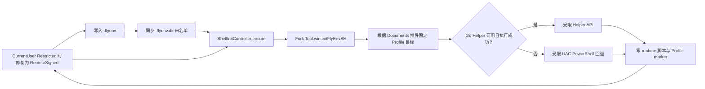

# Windows PowerShell Shell 集成：Helper 优先与 UAC 回退

日期：2026-08-17

状态：已实现并完成定向验证

## 目标

当用户在 Windows 的 Language Projects 中启用项目目录时，FlyEnv 需要把 `flyenv.ps1` 安装到当前用户的 PowerShell Profile，使新开的 PowerShell 能加载 FlyEnv shell 功能；同时将项目目录白名单写入 `.flyenv.dir`。

本次改动的目标不是扩大通用管理员写入能力，而是在保留最小权限面的前提下，让 Profile 写入在 Helper 不可用时仍可通过用户确认的 UAC 完成。

## 原方案与失败条件

原 `initFlyEnvSH` 的流程是：复制 runtime 脚本、使用 PowerShell 查询 `$PROFILE`、直接读写 Profile，并尝试将当前用户执行策略改为 `RemoteSigned`。该方式在 Windows 上可能出现以下问题。

| 情况 | 原方案的风险或表现 |
| --- | --- |
| Profile 自身输出、报错或副作用 | 查询 `$PROFILE` 时会加载已有 Profile，stdout 不再是纯路径，导致路径解析错误或命令失败。 |
| PowerShell 7 未安装、命令路径异常或版本不符 | `pwsh.exe` 不存在、被替换，或返回的 PowerShell edition 不符合预期；原实现只记录日志，调用方无法获知降级情况。 |
| Profile 为 UTF-8 BOM、UTF-16 LE/BE | 以普通 UTF-8 文本读取和写入可能改变原文件编码或损坏内容。 |
| Documents/Profile 目录不可直接写入 | 文件 ACL、受控文件夹访问、杀毒软件、同步软件锁定等情况会使直接写入失败。 |
| 目录或文件经过 reparse point/symlink | 将特权写入直接落到用户控制的重解析路径会扩大写入风险。 |
| 已有 Hook 被重复执行 | 仅按单条加载命令查重，无法可靠更新旧路径，也没有完整 marker 的一致性校验。 |
| 并发触发 | 多次项目设置可能同时修改同一个 Profile，产生重复块或覆盖竞争。 |
| 执行策略被组策略控制 | `MachinePolicy`/`UserPolicy` 强制 `Restricted` 或 `AllSigned` 时，静默 `Set-ExecutionPolicy` 无法生效，且原实现吞掉了失败。 |
| Renderer 页面生命周期结束 | 原先由 `LanguageProjects/Project.ts` 直接管理 IPC；页面卸载时，进度、错误和监听清理没有稳定的操作所有者。 |

此外，通用 `writeFileByRoot` 的允许根目录不应为了写 Profile 而扩展到整个 Documents。那会把一个特定的 shell 集成需求变成任意特权文件写入能力。

## 最终方案

### 总体流程



流程顺序固定为：先完成 `.flyenv` 写入、项目目录持久化和 `.flyenv.dir` 白名单同步，再安装 shell hook。这样不会出现 hook 已写入但 shell 白名单未写入的半完成状态。

### Profile 目标

Fork 模块不再启动 PowerShell 查询 `$PROFILE`。Windows 的 Profile 位置由 Electron 提供的 `app.getPath('documents')` 推导，分别使用：

- Windows PowerShell：`<Documents>\WindowsPowerShell\Microsoft.PowerShell_profile.ps1`；
- PowerShell 7：`<Documents>\PowerShell\Profile.ps1`。

这里的目标是写入固定配置，不依赖 PowerShell 7 当前是否安装或是否在 PATH 中；以后安装 PowerShell 7 时也能直接使用该配置。实现只传递 `edition` 和 `path`，不会为了写配置去发现或启动 `pwsh.exe`。这样不会加载已有 Profile，也不会因 Profile 输出、OneDrive 本地化或重定向而污染路径发现。执行策略修复和 UAC 负载会先同步环境，并使用缓存的 `EnvSync.PowerShellPath`，且统一传入 `-NoProfile -NonInteractive`。

Shell 集成初始化会读取 `Get-ExecutionPolicy -Scope CurrentUser`。仅当结果为 `Restricted` 时，自动执行 `Set-ExecutionPolicy RemoteSigned -Scope CurrentUser -Force`。该 scope 写入当前用户配置，不需要管理员权限；如果 `MachinePolicy`/`UserPolicy` 由组策略覆盖，修复可能失败或不改变有效策略，此时保留 warning 并继续完成配置写入，不会伪造策略已修复。

### Helper 优先，UAC 回退

新增专用 Helper 合约：

```text
tools/installFlyEnvPowerShellIntegration
```

请求仅包含：

```ts
{
  scriptPath: string,
  scriptBase64: string,
  profiles: Array<{
    edition: 'windows-powershell' | 'pwsh',
    path: string
  }>
}
```

Helper 正常可用时由 Go Helper 处理。对于这个专用操作，Helper 二进制缺失、健康检查/版本/管道/启动失败，或 Helper 返回执行失败，都会自动转入 UAC fallback。有效 Helper 响应中的业务错误（`code: 1`）对所有通用方法仍直接返回给调用方；只有这个专用方法会把该类错误送入 UAC。这样不会把证书、自动启动、系统环境变量或通用文件操作的正常业务拒绝扩展为提权请求。UAC 取消或 fallback 执行失败会作为终态错误回到 renderer，不会伪造成功。

自动 fallback 只改变当前运行期的有效传输方式，不会覆盖用户在 `setup.windowsElevationMethod` 中选择的 Helper；Helper 健康检查恢复后会自动恢复运行期的 Helper。为兼容旧版本已经错误保存为 `uac` 的状态，这个专用 shell 集成操作仍会先探测 Helper，再决定是否回退。

Helper 版本由 20 升至 21，以确保旧版本 Helper 不会误认为它支持新合约；旧版本会按版本不匹配走 UAC 回退。

### 最小权限边界

该 API 不复用、不放宽通用 `writeFileByRoot` 的 allowed roots，而是分别在 Go Helper 与 UAC fallback 中执行相同的输入约束：

| 目标 | 限制 |
| --- | --- |
| runtime 脚本 | 必须精确等于受原有 FlyEnv 数据根白名单约束的 `<root>\\bin\\flyenv.ps1`。 |
| Windows PowerShell Profile | 必须位于调用该操作的用户 home 下无 reparse point 的路径，且以 `WindowsPowerShell\\Microsoft.PowerShell_profile.ps1` 结尾。 |
| PowerShell 7 Profile | 必须位于调用该操作的用户 home 下无 reparse point 的路径，且以 `PowerShell\\Profile.ps1` 结尾。 |
| 路径安全 | 不信任调用方传入的任意路径；拒绝用户 home 外的目标、相对路径、traversal、控制字符、重复 edition 与 reparse/symlink 组件。这允许 Windows 将 Documents 本地化或重定向至 home 内的 OneDrive 目录。 |
| 内容安全 | runtime 脚本使用 Base64，最大 1 MiB；Profile 内容不由调用者传入，只能生成固定 marker block。 |

UAC fallback 不复用通用 `Sudo` 的 `command.bat`、`execute.bat` 或 data-file 传输。它把校验后的完整请求、调用用户 home 和子 PowerShell 脚本压缩后直接嵌入 `Start-Process -Verb RunAs` 的参数；构造时将总长度限制在 Windows 命令行安全余量内，过大的请求会失败而不是退回临时负载文件。临时目录只保存随机路径的结果信封，结果中的 nonce 必须与内联 nonce 匹配，且结果不会用于授权特权写入。

提升后的脚本会重新校验 runtime 根目录。除 reparse point 和文件大小限制外，`%ProgramData%\\FlyEnv\\flyenv.allowed-roots` 及其父目录都必须由 `SYSTEM` 或内置 `Administrators` 拥有，且任何非信任 SID 不得具有写入、删除、修改 ACL 或取得所有权的 Allow 权限。调用用户的 home 在提升前被捕获并内联传入，因此即使 UAC 使用另一个管理员账户，也只会修改原调用用户已发现的固定 Profile 路径。

Profile 采用如下 marker，能更新旧的 FlyEnv block，并在 marker 不完整、重复或歧义时拒绝覆盖；旧的 `# FlyEnv Auto-Load` 两行 block 会迁移为这个 marker。对于 OneDrive 重定向的 Documents，Profile 原子写入使用 PowerShell provider 的字节写入和 `Move-Item`，避免 `.NET File.WriteAllBytes` 在该类目录下返回 `FileNotFoundException`：

```powershell
# >>> FlyEnv shell integration >>>
$flyenvScript = '...\\bin\\flyenv.ps1'
if (Test-Path -LiteralPath $flyenvScript) {
  . $flyenvScript
}
# <<< FlyEnv shell integration <<<
```

两条写入路径均采用同目录临时文件后替换的方式，避免中途写坏原 Profile；并保持 UTF-8、UTF-8 BOM、UTF-16 LE 和 UTF-16 BE 编码。

## 操作所有权与 IPC 契约

本次按模块边界划分状态和操作生命周期：

| 项目 | 所有者 | 生命周期 |
| --- | --- | --- |
| 项目选择、目录列表 | `LanguageProjects/Project` | 页面/项目领域状态 |
| PowerShell 初始化 IPC、进度、通知、重入和监听清理 | `Tools/ShellInitController` 单例 | 可跨页面存活的 renderer 操作 |
| Profile 目标推导、Helper/UAC 调用 | Fork `Tool.win` | 单次 fork 操作 |
| 特权文件写入 | Go Helper 或 UAC PowerShell | 特权调用期间 |

IPC 中 `code: 200` 为中间进度，只有 `code: 0` 和 `code: 1` 是终态。`ShellInitController` 负责在终态执行 `IPC.off(key)`，并以 `inFlight` 合并重复 `ensure()` 调用。Fork 层也以 `initFlyEnvSHInFlight` 进行 single-flight，避免并发改写 Profile。

结果是结构化的 `FlyEnvShellInitResult`：包含脚本状态、每个 Profile 的 `updated/unchanged/skipped/failed` 状态和 warnings。没有任何可写 Profile 则返回失败。

## 最终代码变更

| 文件 | 变更 |
| --- | --- |
| `src/fork/module/Tool.win/init.ts` | 重写 `initFlyEnvSH`：推导固定 Profile 目标、single-flight、调用 Helper/UAC、返回结构化结果。 |
| `src/fork/Helper.ts` | 注册新 Helper 方法；只有专用 shell 集成会把有效 Helper 业务错误转入 UAC，并修复 socket `end/error` 双回退竞争。 |
| `src/shared/WindowsHelperState.ts` | 把新方法加入 fallback allowlist；扩充可触发回退的 Helper 故障码。 |
| `src/shared/WindowsHelperFallback.ts` | 新增与 Go Helper 对等的参数、调用用户和 roots ACL 复验；shell 集成使用直接参数式 UAC 启动器而非通用 `Sudo` 临时脚本。 |
| `src/shared/AppHelperCheck.ts` | 将 Helper 合约版本升级为 21，避免旧 Helper 被当作支持新操作。 |
| `src/helper-go/contract/helper-contract.json` | 登记 `tools/installFlyEnvPowerShellIntegration` 合约。 |
| `src/helper-go/main.go` | 分派新方法，并将 Helper 版本升级为 21。 |
| `src/helper-go/module/tool.go` | 实现 marker 对账、编码保持、原子写入和专用集成 API。 |
| `src/helper-go/utils/whitelist.go` | 新增当前用户固定 PowerShell Profile 的独立白名单校验，不放宽通用白名单。 |
| `src/render/components/Tools/ShellInitController.ts` | 新增 module-local controller，管理 shell 初始化与目录白名单同步的 renderer IPC 生命周期。 |
| `src/render/components/LanguageProjects/Project.ts` | 移除直接 IPC；白名单同步成功后才调用 controller 安装 hook。 |
| `scripts/flyenv-shell-integration-test.ts` | 验证专用 UAC 计划、命令行长度、PowerShell 语法和在不受保护 roots 上 fail-closed 的无写入行为。 |
| `src/helper-go/module/flyenv_shell_test.go` | 新增 Go 侧 marker、幂等、UTF-8 BOM 与 UTF-16 编码保持测试。 |
| `scripts/renderer-operation-boundaries-test.ts` | 检查 `LanguageProjects` 不再直接持有 IPC，controller 具备进度与终态清理。 |
| `package.json` | 新增 `test:flyenv-shell-integration`。 |

## 验证记录

已通过：

- `yarn test:helper:contract`
- `yarn tsx scripts/windows-helper-state-test.ts`
- `yarn tsx scripts/windows-helper-send-test.ts`
- `yarn test:helper:go`
- `yarn test:helper:go:vet`
- `go vet .`（`src/helper-go`）
- `yarn test:flyenv-shell-integration`
- `yarn test:renderer-operation-boundaries`
- `git diff --check`

`test:flyenv-shell-integration` 验证直接 UAC 子命令可解压和执行，并在临时的、非受保护 roots 上先通过 ACL 校验失败且不修改 runtime/Profile；它同时检查内联 payload、调用用户目录、nonce、命令行上限和 PowerShell AST。实际的 UAC 提升流程不在自动测试中触发。

全量 `npx tsc --noEmit --pretty false` 仍有本次改动前已存在的错误，位于：

- `configs/electron-builder.linux.ts` 的 `packageCategory`；
- `src/fork/module/DNS/index.ts` 的 DNS 类型与 `Resource`；
- `src/fork/module/Image/ImageCompressTask.ts` 的 `jpg`、`avif` 格式类型。

本次涉及的 TypeScript 文件没有出现新增类型错误。

## 范围外事项

- 只在 `CurrentUser` 为 `Restricted` 时尝试设置 `RemoteSigned`，不修改机器级策略，也不绕过组策略。
- 不将 Documents 加入通用 Helper 文件白名单。
- 不新增 Pinia，也不将 Shell 集成状态写入 `config.setup`。
- 不改变服务进程、PID、端口及其启停生命周期。
